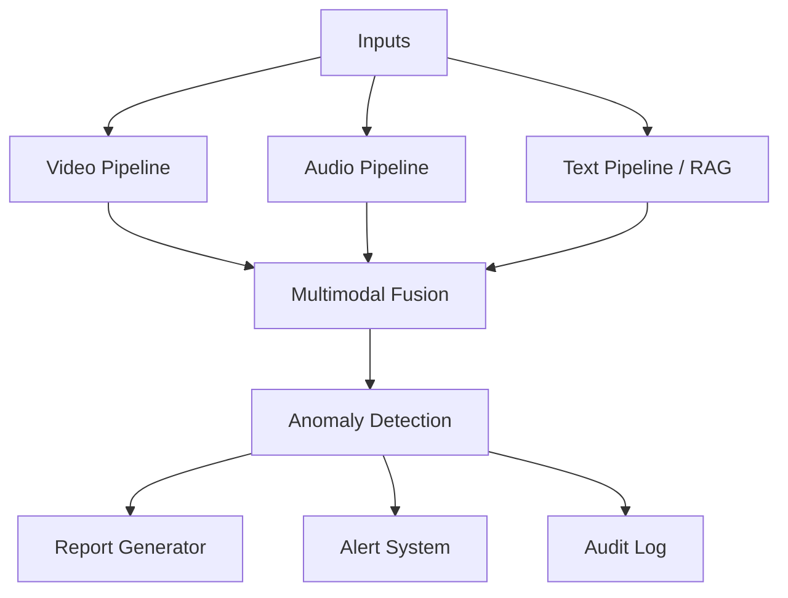
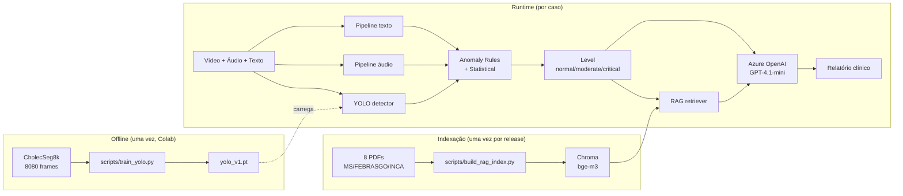

# Arquitetura

## Visão Geral

O sistema recebe entradas multimodais (vídeo, áudio, texto opcional), processa cada modalidade em pipelines especializados, funde os resultados em um orquestrador e gera saídas estruturadas (relatório clínico, alerta categorizado, log de auditoria).



## Como os 3 artefatos se conectam

O sistema combina três artefatos de natureza distinta. Confundir os três é o equívoco mais comum ao ler o pipeline pela primeira vez, então vale explicitar a separação.

| Artefato | O que é | Quando entra |
|---|---|---|
| **Dataset (CholecSeg8k)** | 8080 frames anotados de cirurgia laparoscópica (Grasper + L-hook Electrocautery) | Offline, **antes do runtime**. Usado uma única vez no Colab para treinar `yolo_v1.pt`. ADR-012 |
| **PDFs de diretrizes (RAG)** | 8 documentos clínicos PT-BR indexados no Chroma | Runtime, **no momento da inferência**. Recuperados por similaridade para enriquecer o relatório |
| **LLM (Azure OpenAI GPT-4.1-mini)** | Modelo generativo de propósito geral | Runtime, **na etapa final**. Gera relatório clínico a partir das evidências consolidadas |

Em outras palavras: o **dataset** vira pesos `.pt`, que viram um **detector** chamado a cada frame; os **PDFs** viram chunks vetoriais consultados conforme triggers; o **LLM** apenas redige texto sobre o que os dois primeiros já decidiram. O LLM não treina nem indexa nada em runtime.



## Princípios de Design

1. **Modularidade.** Cada modalidade é um módulo Python isolado com interface bem definida. Trocar implementação não quebra os outros
2. **Backend-agnostic.** Qualquer chamada a serviço externo (Azure, OpenAI, modelos locais) é mediada por uma interface, com toggle entre cloud e local
3. **Stub primeiro, custom depois.** Componentes pesados (YOLO custom) começam com pesos pré-treinados e são trocados quando os custom estiverem prontos
4. **Estado mínimo.** Sem estado global persistente além do log de auditoria (SQLite). Cada chamada é stateless
5. **Observabilidade simples.** Logger Python padrão com formatação consistente, log de auditoria estruturado em SQLite
6. **Configuração por env.** Todas as chaves, paths e flags em `.env`, carregadas via Pydantic Settings

## Estrutura de Diretórios

```
medica-ia-multimodal/
├── src/
│   ├── __init__.py
│   ├── config/
│   │   └── settings.py           (Pydantic Settings, carrega .env)
│   ├── video/
│   │   ├── __init__.py
│   │   ├── detector.py           (YOLO interface, model-agnostic)
│   │   ├── pose.py               (MediaPipe landmarks)
│   │   ├── emotion.py            (FER ou Azure Face)
│   │   ├── azure_video.py        (Azure Video Indexer)
│   │   └── pipeline.py           (orchestra todos acima)
│   ├── audio/
│   │   ├── __init__.py
│   │   ├── transcriber.py        (faster-whisper local + Azure Speech)
│   │   ├── features.py           (librosa: jitter, shimmer, MFCC)
│   │   ├── emotion.py            (wav2vec2)
│   │   ├── azure_language.py     (sentimento + key phrases)
│   │   └── pipeline.py
│   ├── rag/
│   │   ├── __init__.py
│   │   ├── ingestion.py          (carrega PDFs, chunking)
│   │   ├── vector_store.py       (Chroma + bge-m3)
│   │   └── retriever.py
│   ├── anomaly/
│   │   ├── __init__.py
│   │   ├── rules.py              (regras clínicas explícitas)
│   │   ├── statistical.py        (Isolation Forest)
│   │   └── classifier.py         (combina rules + statistical)
│   ├── llm/
│   │   ├── __init__.py
│   │   └── azure_openai.py       (cliente unificado)
│   ├── orchestrator.py           (ponto de fusão multimodal)
│   ├── report.py                 (gera relatório markdown)
│   ├── alert.py                  (estrutura e dispara alerta)
│   └── audit.py                  (logger SQLite)
├── ui/
│   ├── __init__.py
│   ├── tabs/
│   │   ├── tab_video.py
│   │   ├── tab_audio.py
│   │   ├── tab_multimodal.py
│   │   └── tab_audit.py
│   ├── components.py             (helpers reutilizáveis)
│   └── theme.py                  (configuração de tema Gradio)
├── tests/
│   ├── unit/
│   │   ├── test_video.py
│   │   ├── test_audio.py
│   │   ├── test_rag.py
│   │   ├── test_anomaly.py
│   │   ├── test_llm.py
│   │   ├── test_config.py
│   │   └── test_ui.py
│   └── integration/
│       ├── test_orchestrator.py
│       └── test_ui_app.py
├── scripts/
│   ├── build_rag_index.py        (carrega PDFs no Chroma)
│   ├── gen_synthetic_audio.py    (áudios sintéticos para dev)
│   ├── gen_synthetic_pdfs.py     (PDFs sintéticos para RAG)
│   ├── seed_examples.py          (3 casos pré-carregados na UI)
│   ├── train_yolo.py             (rodado uma vez no Colab)
│   └── demo_*.py                 (demos por módulo)
├── data/
│   ├── raw/                      (gitignored)
│   ├── processed/                (gitignored)
│   ├── synthetic/                (commitar amostras pequenas)
│   └── examples/                 (vídeos e áudios de demo, commitados)
├── models/
│   └── .gitkeep                  (modelos baixados via script, gitignored)
├── docs/
├── reports/
├── app.py                        (entrypoint Gradio Blocks)
├── Dockerfile
├── docker-compose.yml
├── pyproject.toml                (Ruff, pytest, dependências)
├── requirements.txt              (gerado a partir do pyproject)
├── .env.example
├── .gitignore
├── README.md
└── LICENSE
```

## Pipelines por Modalidade

### Pipeline de Vídeo

Entrada: caminho de vídeo.
Saída: lista estruturada de eventos por frame.

```python
class VideoEvent(BaseModel):
    frame_index: int
    timestamp_ms: int
    detections: list[Detection]      # YOLO
    pose_landmarks: list[Landmark]   # MediaPipe
    facial_emotion: EmotionScore | None
    azure_metadata: dict | None
```

Fluxo:

1. Extração de frames com OpenCV (1 a 5 fps configurável)
2. YOLO detector em cada frame
3. MediaPipe em paralelo para landmarks
4. FER ou Azure Face em ROIs faciais detectadas
5. Azure Video Indexer chamado uma vez no vídeo completo (cenas, transcrição embutida)
6. Agregação em lista de `VideoEvent`

### Pipeline de Áudio

Entrada: caminho de áudio.
Saída: estrutura com transcrição, features e emoção.

```python
class AudioAnalysis(BaseModel):
    transcription: str
    segments: list[Segment]          # com timestamps
    acoustic_features: AcousticFeatures
    emotion: EmotionScore
    sentiment: SentimentResult
    key_phrases: list[str]
    azure_metadata: dict | None
```

Fluxo:

1. Transcrição via faster-whisper (local) ou Azure Speech (toggle)
2. librosa extrai features acústicas
3. wav2vec2 classifica emoção predominante
4. Azure Language analisa sentimento e frases-chave da transcrição

### Pipeline RAG

Entrada: query textual.
Saída: lista de chunks relevantes com metadata.

Fluxo:

1. Vector store Chroma indexado com PDFs em `scripts/build_rag_index.py`
2. Embeddings via bge-m3 (multilíngue, roda em CPU)
3. Retriever LangChain com filtros opcionais por fonte e seção

Documentos indexados (8 PDFs):

- Manual MS Pré-natal de baixo e alto risco (`manual_ms_prenatal`)
- Diretriz FEBRASGO de pré-eclâmpsia (`febrasgo_preeclampsia`)
- Manual MS Gestação de Alto Risco (`ms_gestacao_alto_risco`)
- INCA — Diretrizes de Detecção Precoce do Câncer de Mama (`inca_cancer_mama`)
- INCA — Diretrizes de Detecção Precoce do Câncer do Colo do Útero (`inca_cancer_colo_utero`)
- MS — PCDT de IST e Atenção a Vítimas de Violência (`ms_pcdt_ist_violencia`)
- MS — Diretrizes de Atenção ao Parto Normal (`ms_parto_normal`)
- Caderno de Atenção Básica nº 26 — Saúde Sexual e Reprodutiva (`cab26_saude_sexual_reprodutiva`)

### Pipeline de Anomalia

Entrada: `VideoAnalysis` + `AudioAnalysis` agregados.
Saída: `AnomalyResult` com nível de risco e justificativa.

```python
class AnomalyResult(BaseModel):
    level: Literal["normal", "moderate", "critical"]
    triggers: list[Trigger]
    explanation: str
    recommended_actions: list[str]
```

Fluxo:

1. Regras clínicas explícitas (ex: instrumental cirúrgico detectado em mais de N frames consecutivos eleva o nível para `moderate`, sinalizando procedimento invasivo em curso)
2. Isolation Forest sobre features agregadas (energia da voz, frequência de movimento, etc.)
3. Classificador final combina rules e statistical com prioridade para regras críticas

## Orquestrador

Ponto único de entrada para um caso completo. Recebe vídeo + áudio + contexto opcional, chama os pipelines, funde resultados, dispara anomaly detection, gera relatório e alerta.

```python
class CaseInput(BaseModel):
    video_path: Path | None
    audio_path: Path | None
    text_context: str | None
    patient_metadata: dict

class CaseOutput(BaseModel):
    video_analysis: VideoAnalysis | None
    audio_analysis: AudioAnalysis | None
    rag_context: list[Chunk]
    anomaly: AnomalyResult
    report_markdown: str
    audit_id: int
```

Implementação em `src/orchestrator.py`. Função principal `process_case(input: CaseInput) -> CaseOutput`.

## UI Gradio Blocks

App em `app.py` monta 4 abas, importando componentes de `ui/tabs/`.

- **Aba Vídeo:** upload de vídeo, mostra player com bounding boxes, timeline de eventos
- **Aba Áudio:** upload de áudio, mostra transcrição com highlights de risco, gráfico de features
- **Aba Multimodal:** upload combinado, mostra relatório clínico final com alertas
- **Aba Auditoria:** explora log SQLite da sessão, exporta JSON

Tema: `gr.themes.Soft()` com paleta dark indigo, definido em `ui/theme.py`. Componentes reutilizáveis (badges de risco, helpers de formatação) em `ui/components.py`.

## Configuração

`.env` carregado via Pydantic Settings em `src/config/settings.py`. Variáveis principais:

```
AZURE_SPEECH_KEY=
AZURE_SPEECH_REGION=
AZURE_LANGUAGE_KEY=
AZURE_LANGUAGE_ENDPOINT=
AZURE_VIDEO_INDEXER_KEY=
AZURE_VIDEO_INDEXER_ACCOUNT_ID=
AZURE_FACE_KEY=
AZURE_FACE_ENDPOINT=
AZURE_OPENAI_KEY=
AZURE_OPENAI_ENDPOINT=
AZURE_OPENAI_DEPLOYMENT=
USE_CLOUD_TRANSCRIPTION=false
USE_CLOUD_EMOTION=false
YOLO_WEIGHTS_PATH=models/yolo_v1.pt
RAG_INDEX_PATH=data/processed/chroma
LOG_LEVEL=INFO
```

## Observabilidade

- **Logger Python** com formatação JSON em produção, console em dev
- **Audit log** em SQLite registrando: timestamp, case_id, modalidades processadas, modelos usados, custo Azure estimado, anomalia detectada
- **Métricas básicas** em `reports/`: latência por pipeline, taxa de detecção, distribuição de emoções

## Deploy

Local:

```bash
docker compose up
```

Hugging Face Spaces:

- `Dockerfile` na raiz do repo
- HF Spaces detecta e builda automaticamente
- Variáveis de ambiente configuradas pelo painel do Spaces (sem commitar `.env`)

## Próximos Passos para Evoluir (fora do escopo atual)

- Funcionalidade de sinais vitais (4ª opção do enunciado): integrar dados de cardiotocografia ou pressão arterial como nova modalidade no orquestrador
- Detecção de sinais de violência doméstica: requer dataset rotulado específico e cuidado ético adicional
- Backend dedicado (FastAPI) com frontend React: separa UI de inferência para escalar horizontalmente
