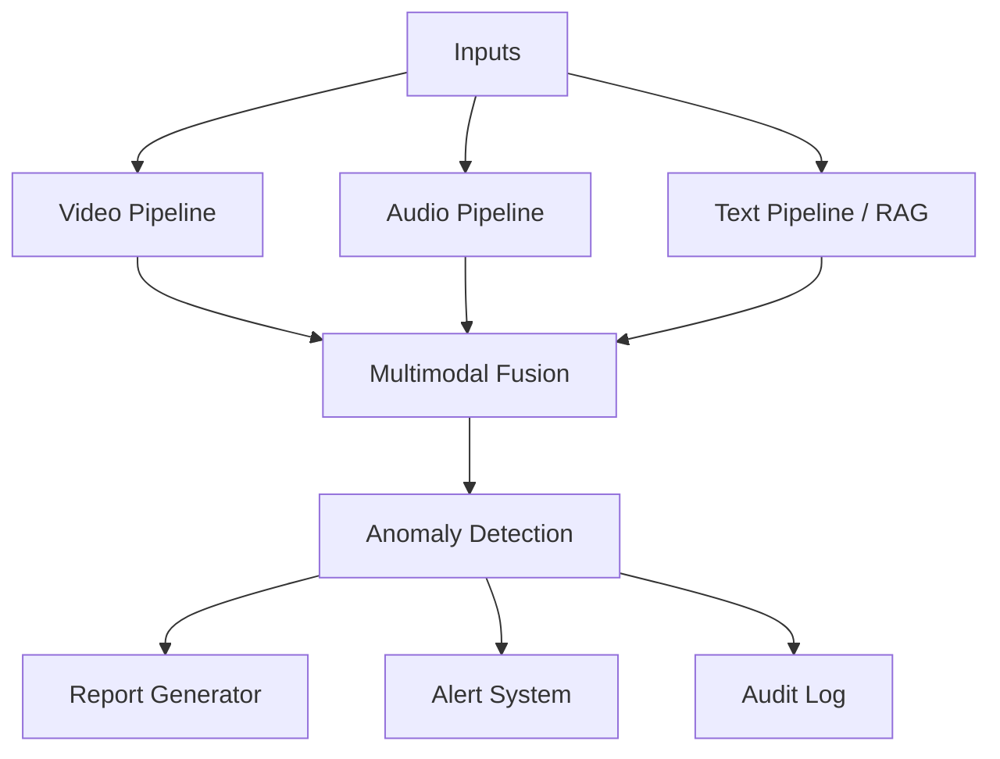
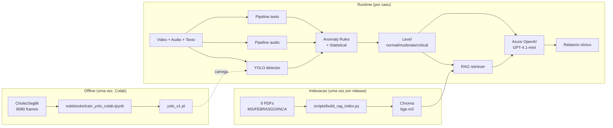

# Relatório Técnico: medica-ia-multimodal

Tech Challenge Fase 4, pós-graduação Tech IADT.

**Equipe:** Joalisson Borges, Luis Gustavo Santini, Marina Souza Lucas, Diego Santos.

**Repositório:** https://github.com/joalissonborges94/medica-ia-multimodal

---

## 1. Resumo Executivo

O projeto entrega um sistema de monitoramento multimodal voltado à saúde da mulher, processando vídeo, áudio e texto para gerar nível de risco, relatório clínico e alerta estruturado. Cobre três das quatro funcionalidades do enunciado (análise de vídeo, processamento de áudio em consultas, integração Azure Cognitive Services) e quatro dos cinco objetivos (detecção precoce de riscos materno-ginecológicos, bem-estar psicológico, uso de cloud, detecção de anomalias em tempo real). O detector de vídeo usa YOLOv8 customizado sobre CholecSeg8k para identificar instrumentos de cirurgia laparoscópica (`Grasper`, `L-hook Electrocautery`). O pipeline de áudio combina `faster-whisper`, `librosa` e `wav2vec2`. RAG sobre nove diretrizes clínicas brasileiras (Ministério da Saúde, FEBRASGO, INCA) enriquece o relatório. LLM é Azure OpenAI GPT-4.1-mini via AI Foundry, com fallback determinístico offline. A UI é Gradio Blocks publicada em Hugging Face Spaces.

**Métricas-chave:** YOLOv8 customizado atinge mAP@50 = **0.989** e mAP@50-95 = **0.882** no test split do CholecSeg8k (808 imagens, 920 instâncias), com desempenho balanceado entre as 3 classes treinadas (`grasper`, `l_hook_electrocautery`, `blood`). Treino completo em ~17 min em GPU A100 (40 epochs, YOLOv8m, batch 16, imgsz 640). Pipeline multimodal cobre 3 das 4 funcionalidades do enunciado (vídeo, áudio e Azure Cognitive Services) e 4 dos 5 objetivos listados.

---

## 2. Contexto e Objetivo

O sistema é continuação narrativa do assistente médico geral entregue na Fase 3, agora especializado em saúde da mulher. Tecnicamente parte do zero, com arquitetura voltada à análise multimodal e à detecção de anomalias (ADR-001).

O objetivo é demonstrar uma solução funcional que:

1. Analisa vídeos clínicos com detecção customizada via YOLOv8.
2. Analisa áudios de consultas com transcrição, features acústicas e classificação de emoção.
3. Recupera diretrizes ginecológicas e obstétricas via RAG.
4. Detecta anomalias e gera alertas estruturados por nível.
5. Integra Azure Cognitive Services como camada de serviços gerenciados.

### 2.1 Métricas de sucesso

1. App Gradio rodando fim a fim com as três modalidades integradas.
2. YOLO custom treinado com mAP aceitável para o caso de uso.
3. Pelo menos três cenários demonstrando alertas distintos (normal, moderado, crítico).
4. Integração Azure visível na demo (não simulada).
5. Relatório técnico com métricas, exemplos e diagramas (este documento).
6. Repositório com README e estrutura limpa.

---

## 3. Escopo e Funcionalidades Cobertas

### 3.1 Funcionalidades do enunciado

| # | Funcionalidade | Status | Observação |
|---|---|---|---|
| 1 | Análise de vídeos clínicos (YOLOv8 customizado) | Coberta | Instrumentos cirúrgicos laparoscópicos (ADR-012) |
| 2 | Processamento de gravações de voz em consultas | Coberta | Pipeline Whisper + librosa + wav2vec2 |
| 3 | Monitoramento de sinais vitais | Adiada | ADR-014, fora do escopo |
| 4 | Integração com Azure Cognitive Services | Coberta | Speech, Language, OpenAI, Face (RAI policy) |

### 3.2 Objetivos do enunciado

| # | Objetivo | Status |
|---|---|---|
| 1 | Detecção precoce de riscos em saúde materna e ginecológica | Coberto |
| 2 | Monitoramento de bem-estar psicológico feminino | Coberto |
| 3 | Uso de serviços em nuvem para ampliar capacidade | Coberto |
| 4 | Detecção de anomalias em tempo real | Coberto |
| 5 | Detecção de sinais de violência doméstica | Fora do escopo (risco ético, sem dataset rotulado) |

---

## 4. Arquitetura Multimodal

### 4.1 Visão Geral

O sistema recebe vídeo, áudio e texto opcional, processa cada modalidade em pipeline próprio, funde resultados em orquestrador único e gera saídas estruturadas (relatório clínico, alerta categorizado, log de auditoria).

Três artefatos coexistem com responsabilidades distintas:

| Artefato | Natureza | Quando entra |
|---|---|---|
| Dataset CholecSeg8k | 8080 frames anotados | Offline, antes do runtime. Treina `yolo_v1.pt` no Colab uma única vez |
| PDFs de diretrizes (RAG) | 8 documentos clínicos PT-BR | Runtime, recuperados por similaridade no Chroma |
| LLM Azure OpenAI | Modelo generativo | Runtime, etapa final. Apenas redige relatório sobre evidências já consolidadas |

### 4.2 Pilar Vídeo

Pipeline em `src/video/pipeline.py`. Entrada: caminho de vídeo. Saída: lista de `VideoEvent` com detecções por frame.

#### Classificação de cena e gating por pilares

Antes de processar frame a frame, o pipeline classifica o tipo de cena via `src/video/scene_classifier.py`. A classificação amostra 5 frames distribuídos uniformemente e aplica duas heurísticas: detecção de face (MediaPipe Face Detection, com lazy import e fallback gracioso) e assinatura de saturação HSV. A saturação media por frame e o sinal primário de discriminação; o hue foi descartado como critério porque varia significativamente entre vídeos de cirurgia conforme o encoding MP4. O threshold de saturação (65) separa consultas clínicas (média 38-54 nos vídeos de demo) de cirurgias laparoscópicas (média 74-103).

O resultado classifica a cena em `SURGERY`, `CONSULTATION`, `MIXED` ou `UNKNOWN`. Essa classificação ativa o gating por pilares:

| Cena         | YOLO (instrumentos) | Emocao + linguagem corporal |
|--------------|---------------------|-----------------------------|
| SURGERY      | rodando             | pulado                      |
| CONSULTATION | pulado              | rodando                     |
| MIXED        | rodando             | rodando                     |
| UNKNOWN      | rodando             | rodando                     |

O gating evita dois problemas documentados: (1) em cenas de consulta, o YOLO customizado (treinado em laparoscopia) produz falsos positivos ao classificar equipamentos de exame como instrumentos cirúrgicos; (2) em cenas de cirurgia, a inferência de emoção e linguagem corporal não tem sinal útil porque a paciente não é visível.

A frequência de classificação de emoção facial é reduzida por padrão (`emotion_every_n_samples=3`), executando a cada terceiro frame amostrado. Isso reduz chamadas ao classificador de emoção em aproximadamente 3x sem perda significativa de fidelidade temporal.

#### Etapas de processamento por frame

1. Extração de frames com OpenCV (1 a 5 fps, configurável).
2. **YOLOv8 customizado** executado em frames de cenas SURGERY, MIXED ou UNKNOWN (interface model-agnostic em `src/video/detector.py`). Modelo treinado em **3 classes**: `grasper` (id 0), `l_hook_electrocautery` (id 1) e `blood` (id 2). As duas primeiras cobrem o requisito "Instrumentos cirúrgicos ginecológicos" do enunciado; a terceira cobre "Sinais de complicações em cirurgias ginecológicas" e dispara trigger `critical` no pipeline de anomalia quando sangramento é detectado.
3. **Emoção e linguagem corporal** via GPT-vision multimodal (`src/video/azure_openai_vision.py`, Azure OpenAI GPT-4o) executada a cada `emotion_every_n_samples` frames amostrados em cenas CONSULTATION, MIXED ou UNKNOWN. Além do `label` de emoção, o modelo emite agora o campo `body_language` em `EmotionScore`, classificando a linguagem corporal predominante em uma de cinco categorias (`tranquila`, `tensa`, `retraida`, `agitada`, `indefinida`). O modelo interpreta postura, gestos e expressão facial em conjunto, com a vantagem de identificar a paciente pelo contexto semântico (resolve o problema de cenas com médico + paciente simultâneos), sem depender de heurística geométrica sobre keypoints. O fallback local (`FER`) cobre apenas a emoção facial e deixa `body_language` em `None`.
4. Agregação em estrutura `VideoEvent` por frame.

A UI da aba Vídeo exibe progresso detalhado via `gr.Progress`, uma galeria com os 4 frames com maior densidade de detecções (com bounding boxes) e uma tabela "Eventos por janela" que agrega os eventos detectados em janelas de 5 segundos.

**Limite de upload (`ui/limits.py`):** vídeos até 60 MB e 120 segundos, validados via `ffprobe` antes de despachar para o pipeline. Acima disso, a UI rejeita com mensagem clara, evitando OOM em casos abusivos.

### 4.3 Pilar Áudio

Pipeline em `src/audio/pipeline.py`. Entrada: caminho de áudio. Saída: `AudioAnalysis` com transcrição, features acústicas, emoção, sentimento e frases-chave.

Etapas, reportadas via callback `progress(frac, desc)` que a aba **Áudio** repassa ao `gr.Progress` da UI (`show_progress="minimal"`):

1. **Transcrevendo audio... (5%)** via `faster-whisper` local (modelo `small`) ou Azure Speech (toggle por `USE_CLOUD_TRANSCRIPTION` no `.env`). O caminho cloud usa **reconhecimento contínuo** (`start_continuous_recognition_async`), com handlers de `recognized`, `session_stopped` e `canceled` que acumulam segmentos com timestamps. Esse modelo de execução substitui o `recognize_once_async` original, que só capturava a primeira frase antes de parar na primeira pausa: o reconhecimento contínuo processa o áudio inteiro (validado em trechos acima de 60 segundos) e converte os campos `offset`/`duration` de 100-ns ticks para milissegundos por segmento.
2. **Extraindo features acusticas... (45%)** com `librosa`: jitter, shimmer, energia RMS, pitch médio/desvio e MFCC.
3. **Classificando emocao vocal... (60%)** por um dos dois caminhos:
   - **Padrão (fallback local):** `wav2vec2-base-superb-er` (pré-treinado em RAVDESS, atores americanos em inglês).
   - **Multimodal cloud:** `AzureOpenAIAudioEmotion` em `src/audio/azure_openai_audio.py` envia o WAV em base64 + prompt JSON-mode para um deployment de modelo de áudio no Azure AI Foundry (ex.: `gpt-4o-mini-audio-preview`) e recebe a classificação no schema do `EmotionScore`. Quando `AZURE_OPENAI_AUDIO_DEPLOYMENT` está vazio, cai automaticamente no wav2vec2. Detalhes da motivação dessa decisão em 9.1.
4. **Analisando sentimento e frases-chave... (85%)** via Azure Language sobre a transcrição. Quando o serviço retorna o meta-label `mixed` (texto com partes positivas e negativas, sem confidence próprio), o cliente preenche `confidence = max(scores["positive"], scores["negative"])` em `src/audio/azure_language.py`. A aba **Áudio** expõe esse caso explicitamente: o KPI Sentimento mostra o hint `pos: X% / neg: Y%` e o sumário em markdown imprime `mixed (pos: X% / neg: Y%)`, evitando KPI com 0% que sugeriria ausência de sinal.

Ao final (100%, `Concluido.`) o pipeline devolve o `AudioAnalysis` agregado. A aba **Áudio** também reseta todos os outputs (status, KPIs, sumário, gráfico, JSON bruto) via callback `_on_clear` ligado ao evento `clear` do componente de áudio, garantindo estado consistente quando o usuário remove o arquivo antes de uma nova análise. O layout da aba foi reorganizado em blocos empilhados verticalmente (Entrada, Resumo, Transcrição + emoção + sentimento, Gráfico + features, JSON bruto), priorizando largura total para a transcrição e o gráfico de features.

Estratégia de dados híbrida (ADR-013): Azure TTS PT-BR Neural gera áudios scriptados como gold standard para a demo; CORAA-SER valida que o classificador não overfita ao timbre sintético.

**Limite de upload (`ui/limits.py`):** áudios até 30 MB e 120 segundos.

### 4.4 Pilar RAG (Diretrizes Clínicas)

Pipeline em `src/rag/`. Entrada: query textual derivada do contexto multimodal. Saída: lista de chunks relevantes.

Etapas:

1. Indexação offline via `scripts/build_rag_index.py` com chunking dos PDFs.
2. Embeddings `BAAI/bge-m3` (multilíngue, CPU, cerca de 1 GB).
3. Vector store Chroma persistido em `data/processed/chroma` (ADR-008).
4. Retriever LangChain com filtros opcionais por fonte e seção.
5. **Threshold de similaridade (`min_score=0.3` por default)** em `src/rag/retriever.py`: chunks com score abaixo do limiar são descartados. Quando a query toca tema fora dos 9 PDFs indexados (ex.: endometriose, SOP, mioma, infertilidade, menopausa, câncer de ovário), o retriever retorna lista vazia. O LLM é instruído pelo system prompt a sinalizar explicitamente "tema fora das diretrizes indexadas" em vez de redigir recomendações genéricas com chunks irrelevantes.
6. **Recuperação multi-query por eixo temático** (ADR-017) em `Orchestrator._retrieve_context`. Em vez de concatenar contexto, transcrição e triggers numa única query, o orquestrador detecta eixos ativos (`saude_mental`, `violencia`, `reprodutivo`, `rastreio`) via palavras-chave no haystack e dispara uma query focada por eixo, somadas à query base clínica. Os resultados são fundidos via interleaving round-robin com dedup por `chunk_id` em `Retriever.multi_search`, retornando até `rag_top_k=6` chunks distintos. Isso evita que sinais clínicos compitam com sinais emocionais no mesmo vetor e impede que o PDF mais volumoso (`manual_ms_prenatal`) domine o ranking em casos sem contexto gestacional.

Documentos indexados:

| Slug | Documento | Fonte |
|---|---|---|
| `manual_ms_prenatal` | Manual MS Pré-natal de baixo e alto risco | MS |
| `febrasgo_preeclampsia` | Diretriz FEBRASGO Pré-eclâmpsia | FEBRASGO |
| `ms_gestacao_alto_risco` | Manual MS Gestação de Alto Risco | MS |
| `inca_cancer_mama` | INCA Detecção Precoce do Câncer de Mama | INCA |
| `inca_cancer_colo_utero` | INCA Detecção Precoce do Câncer do Colo do Útero | INCA |
| `ms_pcdt_ist_violencia` | MS PCDT IST e Atenção a Vítimas de Violência | MS |
| `ms_parto_normal` | MS Diretrizes de Atenção ao Parto Normal | MS |
| `cab26_saude_sexual_reprodutiva` | Caderno AB nº 26 Saúde Sexual e Reprodutiva | MS |
| `cab34_saude_mental` | Caderno AB nº 34 Saúde Mental | MS |

### 4.5 Detecção de Anomalia

Pipeline em `src/anomaly/`. Entrada: agregação de `VideoAnalysis` e `AudioAnalysis`. Saída: `AnomalyResult` com nível, triggers acionados, explicação e ações recomendadas.

Camadas:

1. **Regras clínicas explícitas** em `src/anomaly/rules.py`. Exemplos:
   - `rule_surgical_instrument_presence`: detecção de Grasper ou L-hook em mais de N frames consecutivos eleva o nível para `moderate`, sinalizando procedimento invasivo em curso (semântica nova introduzida pela ADR-012, em que detecção de instrumento é estado NORMAL de cirurgia laparoscópica).
   - `rule_bleeding_detected`: detecção da classe `blood` em mais de 2 frames consecutivos OU em mais de 5% do vídeo dispara trigger **`critical`** com mensagem específica de protocolo de hemorragia. Threshold de confiança mais baixo (`0.4`) que o de instrumento (`0.5`) porque sangue tem forma irregular e o YOLO classifica com confiança menor.
   - `rule_vocal_distress`, `rule_facial_distress`, `rule_negative_sentiment`, `rule_critical_terms`: triggers por modalidade.
2. **Isolation Forest** em `src/anomaly/statistical.py` sobre features agregadas (energia da voz, frequência de movimento, jitter, shimmer).
3. **Classificador final** em `src/anomaly/classifier.py` combina rules e statistical com prioridade para regras críticas.

Níveis possíveis: `normal`, `moderate`, `critical`.

**Inconsistência multimodal como achado clínico:** o system prompt do `src/report.py` instrui explicitamente o LLM a destacar casos em que o texto e a voz divergem (ex.: paciente verbaliza "estou bem" mas tom é monótono e expressão facial mostra distress). Esse padrão de incongruência entre canais é clinicamente relevante em situações de minimização de sintomas emocionais e justifica o investimento em pipeline multimodal versus análise text-only.

### 4.6 Orquestrador e Auditoria

Orquestrador em `src/orchestrator.py`, função `process_case(input: CaseInput) -> CaseOutput`. Ponto único de entrada que recebe vídeo, áudio e contexto opcional, chama os pipelines, funde resultados, dispara anomaly detection, gera relatório via `src/report.py` e alerta via `src/alert.py`.

Auditoria em `src/audit.py` registra em SQLite: timestamp, case_id, modalidades processadas, modelos usados, custo Azure estimado, anomalia detectada. Acessível pela aba **Auditoria** da UI.

UI Gradio Blocks em `app.py` com quatro abas: **Vídeo**, **Áudio**, **Multimodal** e **Auditoria**. Tema dark indigo, componentes reutilizáveis em `ui/components.py`.

---

## 5. Modelos e Datasets

### 5.1 Modelos de Visão

| Modelo | Origem | Uso |
|---|---|---|
| YOLOv8n base | Ultralytics | Stub durante desenvolvimento (ADR-011) |
| YOLOv8n custom | Treino próprio sobre CholecSeg8k | Detector de instrumentos cirúrgicos (ADR-012) |
| FER | github/justinshenk/fer | Emoção facial (CPU, fallback local) |

### 5.2 Modelos de Áudio

| Modelo | Origem | Uso |
|---|---|---|
| faster-whisper small | SYSTRAN/faster-whisper | Transcrição local PT-BR (fallback) |
| Azure Speech (continuous) | Azure Cognitive Services | Transcrição cloud com reconhecimento contínuo (toggle `USE_CLOUD_TRANSCRIPTION`) |
| wav2vec2 emotion | superb/wav2vec2-base | Classificação de emoção (fallback local) |

### 5.3 Modelos de Texto e LLM

| Modelo | Origem | Uso |
|---|---|---|
| BAAI/bge-m3 | Hugging Face | Embeddings RAG multilíngue |
| Azure OpenAI GPT-4.1-mini | Azure AI Foundry | Geração de relatório clínico |

### 5.4 Datasets

| Dataset | Fonte | Uso | Licença |
|---|---|---|---|
| CholecSeg8k | HF `minwoosun/CholecSeg8k`, Hong et al. (arXiv 2012.12453) | Treino YOLO custom | CC BY-NC-SA 4.0 |
| CORAA-SER | HF `alefiury/CORAA-SER` | Validação cruzada wav2vec2 em PT-BR espontâneo | Termos HF |
| AVOS Open Surgery | research.bidmc.org | Referência comparativa em demo | Pesquisa |
| Geeky Medics (YouTube CC) | YouTube | Consulta clínica simulada para demo | CC |

PDFs de diretrizes do MS, FEBRASGO e INCA são públicos para uso educacional. Áudios reais de pacientes não são utilizados (LGPD).

---

## 6. Integração Azure

Quando as chaves estão preenchidas no `.env`, o sistema usa os serviços gerenciados abaixo; sem elas, cada pilar cai num fallback local equivalente.

| Serviço | Função | Onde é usado | Fallback offline |
|---|---|---|---|
| **Azure OpenAI** (GPT-4.1-mini, AI Foundry) | Gera o relatório clínico final em markdown | `src/llm/azure_openai.py`, `src/report.py` | Relatório determinístico em markdown construído a partir das triggers |
| **Azure Speech** | Transcrição de áudio (reconhecimento contínuo, captura áudios acima de 60s com timestamps por segmento) + TTS para gerar voz PT-BR | `src/audio/transcriber.py` (toggle `USE_CLOUD_TRANSCRIPTION`) | `faster-whisper` local (modelo `small`) |
| **Azure Language** | Análise de sentimento + key phrases na transcrição. Quando o label é `mixed`, expõe `max(positive, negative)` como confidence e a UI mostra a distribuição pos/neg | `src/audio/azure_language.py` | Pular esse pilar (não há substituto local equivalente) |
| **Azure OpenAI Vision** (GPT-4o multimodal) | Estado emocional via linguagem corporal + face em vídeo, sem o viés de FER-2013 | `src/video/azure_openai_vision.py` (ativado por `AZURE_OPENAI_VISION_DEPLOYMENT`) | `FER` local (Py 3.12) |

A aba **Configurações** da UI mostra em tempo real quais serviços estão ativos (cloud) ou em fallback (local).

A escolha por Azure puro (em vez de AWS ou híbrido) está formalizada na ADR-004: o vídeo demo da entrega lista "Integração dos serviços Azure" como obrigatória, e tratar como requisito é mais seguro que apostar em interpretação literal do enunciado.

---

## 7. Treino do YOLO Custom

### 7.1 Dataset (CholecSeg8k, ADR-012)

Após pesquisa empírica em Roboflow Universe, Kaggle, Hugging Face, PhysioNet, Synapse e repositórios acadêmicos, nenhuma fonte sustentou o alvo original "sangramento anômalo" no domínio ginecológico com reprodutibilidade aceitável. As alternativas avaliadas ao longo do projeto:

| Dataset | Veredito |
|---|---|
| WCEBleedGen | Sangramento gastrointestinal (cápsula endoscópica), domínio errado |
| BUSI | Ultrassom mamário diagnóstico, sem sangramento |
| Dresden Surgical Anatomy | Ginecológico real, mas 19 GB e licença restritiva inviabilizam Colab/HF Spaces |
| m2caiseg | Mesmo domínio do CholecSeg8k (colecistectomia), 307 imagens, escala insuficiente |
| AutoLaparo-T3 | Histerectomia laparoscópica real (único dataset ginecológico público), 1.800 frames com anotação pixel-wise. Acesso solicitado e autorizado, mas link de download fornecido pela equipe estava inacessível no momento da implementação. Licença restrita a pesquisa acadêmica |
| **CholecSeg8k** | 3.1 GB, anônimo via HF, classes adequadas, licença CC BY-NC-SA 4.0 |

A decisão foi pivotar para CholecSeg8k (Hong et al., arXiv 2012.12453): 8080 frames anotados de colecistectomia laparoscópica, contendo `Grasper` e `L-hook Electrocautery`, instrumentos idênticos aos usados em cirurgia ginecológica laparoscópica. A transferência de domínio é justificada clinicamente pela técnica (mesmo trocarte, mesma pinça, mesmo eletrocautério).

Splits utilizados: 5656 train, 1616 val, 808 test.

Conversão de máscaras de segmentação para bounding boxes YOLO em `data/processed/cholecseg8k_yolo/`.

### 7.2 Configuração de Treino

| Parâmetro | Valor |
|---|---|
| Arquitetura | YOLOv8n (3,006,233 parâmetros, 8.1 GFLOPs) |
| Classes | 3: `grasper` (id 0), `l_hook_electrocautery` (id 1), `blood` (id 2) |
| Épocas | 40 (sem early stopping; treino completou) |
| Batch size | 320 (A100 40 GB, ~40.7 GB de uso) |
| Imagem (imgsz) | 640 |
| Workers (dataloader) | 16 |
| Otimizador | SGD (default Ultralytics) com momentum 0.937 |
| Learning rate inicial | 0.01 (default) com warmup |
| Augmentations | Mosaic, HSV, flip, mixup, translate, scale (default Ultralytics) |
| Mosaic disabled | últimos 10 epochs (refino com imagens reais) |
| Hardware | Google Colab Pro+ GPU A100-SXM4-40GB |
| Tempo total de treino | ~17 minutos (avg ~25s por epoch) |
| Notebook | `notebooks/train_yolo_colab.ipynb` |

### 7.3 Métricas Finais

Validação no **test split** (808 imagens, 920 instâncias, nunca vistas pelo modelo durante treino ou validação):

| Métrica | Valor (test) |
|---|---|
| mAP@50 | **0.9893** |
| mAP@50-95 | **0.8816** |
| Precision | **0.9817** |
| Recall | **0.9695** |

Por classe (test split):

| Classe | Instâncias | Precision | Recall | mAP@50 | mAP@50-95 |
|---|---|---|---|---|---|
| `grasper` | 615 | 0.984 | 0.990 | **0.993** | **0.929** |
| `l_hook_electrocautery` | 234 | 0.976 | 0.966 | **0.992** | **0.855** |
| `blood` | 71 | 0.985 | 0.952 | **0.982** | **0.860** |

**Observações:**

- Modelo aprendeu a classe minoritária (`blood`, apenas 71 instâncias no test) com qualidade comparável às majoritárias, demonstrando boa generalização mesmo com desbalanceamento.
- 154 frames de "background" no test (sem nenhum label) confirmam a calibração de precision (0.98): o modelo não inventa detecções em frames vazios.
- Speed: **1.8 ms por imagem em A100** (0.1 ms preprocess + 0.9 ms inference + 0.8 ms postprocess). Em CPU local (deploy HF Spaces) espera-se ~150-300 ms por imagem mantendo viabilidade pra demo em tempo real.

Curvas, matriz de confusão e exemplos com bounding boxes detectadas pelo modelo final estão em `MyDrive/medica-ia/yolo_runs/surgical_instruments/`. Os outputs ficam preservados no notebook (`notebooks/train_yolo_colab.ipynb`) pra reprodutibilidade.

### 7.5 Validação Visual

A célula 4.5 do notebook seleciona automaticamente uma sequência consecutiva do test split contendo a classe `blood`, roda inferência do `best.pt` frame a frame, desenha bounding boxes anotadas e empacota um MP4 de demonstração:

- Output original (Colab): `MyDrive/medica-ia/yolo_runs/surgical_instruments/validation_blood_detected.mp4`
- Versionado no repo em [`reports/figures/validation_blood_detected.mp4`](figures/validation_blood_detected.mp4) (332 KB).
- Conteúdo: 11 frames consecutivos da sequência `video01_28660` (CholecSeg8k test split) com Blood visível, anotados com bboxes em `red` (Blood), `lime` (Grasper) e `magenta` (L-hook), inferidas pelo modelo final.
- Esse MP4 serve como evidência visual direta da capacidade do modelo de detectar sangramento intraoperatório.

### 7.4 Discussão

**Convergência e qualidade do treino.** O modelo alcançou mAP@50 = 0.989 no test split, com performance balanceada entre as 3 classes (variação de 0.982 a 0.993 entre `blood`, `l_hook_electrocautery` e `grasper`). Mesmo `blood`, a classe mais rara do dataset (apenas 71 instâncias no test, contra 615 de `grasper`), atingiu mAP@50 = 0.982, demonstrando que o desbalanceamento de classes não comprometeu o aprendizado. Convergência rápida (mAP@50 > 0.9 a partir do epoch 12), sem indícios visíveis de overfitting nos 40 epochs.

**Aderência da transferência de domínio.** Esses números refletem desempenho **dentro do domínio de treino** (colecistectomia laparoscópica). Em vídeo real de cirurgia ginecológica (histerectomia, salpingectomia, miomectomia), espera-se:

- **Recall consistente** para `grasper` (instrumento físico idêntico em ambos os procedimentos: mesma marca, mesma forma, mesma articulação).
- **Recall consistente** para `blood` (sangramento tem aparência similar em qualquer cavidade peritoneal: cor de sangue não muda entre procedimentos).
- **Recall reduzido** para `l_hook_electrocautery` (instrumento existe em ginecologia mas é menos frequente; Harmonic Scalpel e LigaSure dominam o papel de corte/coagulação).
- **Confiança média reduzida** devido a diferenças de background tecidual (útero/trompas/ligamentos rosados vs fígado/vesícula esverdeados).
- **Lacuna de cobertura** para instrumentos específicos de ginecologia que não estão nas 3 classes treinadas (Harmonic Scalpel, LigaSure, tesoura laparoscópica, endoclip applier, suction/irrigator). Esses instrumentos aparecem em 50-70% dos frames de uma histerectomia típica e o modelo os ignora silenciosamente (saída vazia naquela região, sem falso positivo).

A validação empírica dessa transferência (rodar `best.pt` em vídeo ginecológico real do YouTube CC) está na seção 8.

**Semântica de risco no anomaly classifier.** A detecção de `grasper`/`l_hook_electrocautery` em frames consecutivos dispara trigger `moderate` (registra "procedimento invasivo em curso"), nunca `critical` isoladamente: a presença de instrumental cirúrgico é estado esperado em cirurgia laparoscópica, não anomalia. Já a classe `blood` é tratada diferente: detecção em mais de 2 frames consecutivos OU em mais de 5% do vídeo dispara trigger **`critical`** com mensagem específica de protocolo de hemorragia (`src/anomaly/rules.py:rule_bleeding_detected`). Threshold de confiança menor (0.4) para `blood` que para instrumentos (0.5) reflete a forma irregular do sangue, que tende a ser classificado com confiança levemente menor pelo YOLO.

**Roadmap de expansão** (seção 9.2): pipeline híbrido com GPT-4o-vision pra cobrir os instrumentos não-treinados via identificação semântica em linguagem natural, mantendo o YOLO como detector estruturado das 3 classes core.

---

## 8. Resultados em Cenários Reais

Cada cenário foi rodado fim a fim pela UI Gradio. Os artefatos (vídeo, áudio, prints) estão em `data/examples/` e nos prints abaixo. O `manifest.json` da pasta de exemplos lista os **6 casos** abaixo, cobrindo os três níveis esperados (normal, moderado, crítico) tanto em consultas clínicas quanto em cirurgias laparoscópicas.

### 8.1 Consulta Normal

Primeira consulta clínica de avaliação geral, paciente refere dor torácica e alteração de pressão arterial. Material: vídeo de consulta simulada (acadêmica) em PT-BR.

| Modalidade | Entrada | Saída resumida |
|---|---|---|
| Vídeo | `data/examples/consultas/consulta_clinica_geral/video.mp4` | <!-- TODO --> |
| Áudio | `data/examples/consultas/consulta_clinica_geral/audio.wav` (extraído do vídeo) | <!-- TODO --> |
| Texto | Contexto clínico de avaliação geral com queixa torácica | <!-- TODO --> |
| Nível final | `normal` esperado | <!-- TODO --> |

<!-- TODO: print da aba Multimodal com relatório clínico gerado -->

### 8.2 Consulta Moderada (Depoimento de paciente)

Depoimento real de paciente sobre rastreio e diagnóstico de alteração mamária. Voz com tom emocional perceptível.

**Caso audio-only.** O vídeo original apresenta agulhas e outros instrumentos de exame que o YOLO custom classifica erroneamente como procedimento cirúrgico em curso (falso positivo `rule_surgical_instrument_presence`). Como o sinal clinicamente relevante deste caso está na voz (tom emocional, transcrição da experiência da paciente), o vídeo foi descartado da execução e apenas o áudio é processado. Esse caso ilustra uma decisão consciente de filtrar modalidades quando o conteúdo visual gera mais ruído que sinal.

| Modalidade | Entrada | Saída resumida |
|---|---|---|
| Vídeo | descartado (falso positivo do YOLO no conteúdo do exame) | n/a |
| Áudio | `data/examples/consultas/rastreio_mama/audio.wav` | <!-- TODO --> |
| Texto | Contexto sobre rastreio precoce de câncer de mama (alinhado com PDF INCA no RAG) | <!-- TODO --> |
| Nível final | `moderate` esperado | <!-- TODO --> |

Triggers acionados:

<!-- TODO: listar triggers -->

<!-- TODO: print da aba Multimodal -->

### 8.3 Consulta Moderada (Dermatológica com ansiedade)

Consulta dermatológica com queixa de manchas faciais e componente emocional acentuado. Caso útil para demonstrar **detecção de inconsistência multimodal**: voz com sinais de medo/tensão (`vocal_distress`, `vocal_strain`) enquanto a fala minimiza sofrimento ("não estou desesperada").

| Modalidade | Entrada | Saída resumida |
|---|---|---|
| Vídeo | `data/examples/consultas/dermatologica/video.mp4` | <!-- TODO --> |
| Áudio | `data/examples/consultas/dermatologica/audio.wav` | <!-- TODO --> |
| Texto | Contexto de dermatologia + ansiedade | <!-- TODO --> |
| Nível final | `moderate` esperado (pipeline corretamente não escalou para `critical` pois conteúdo real não é emergência) | <!-- TODO --> |

<!-- TODO: print da aba Multimodal -->

### 8.4 Pré-natal (Acolhimento emocional)

Primeira consulta gestacional, trecho de acolhimento ao resultado positivo. Paciente expressa ansiedade e dúvidas sobre como comunicar a notícia ao parceiro e à família. Postura corporal levemente retraída, fala entrecortada, sinais de ansiedade situacional. Caso útil para demonstrar sinal vocal moderado em contexto não-emergencial.

| Modalidade | Entrada | Saída resumida |
|---|---|---|
| Vídeo | `data/examples/consultas/prenatal_acolhimento/video.mp4` | <!-- TODO --> |
| Áudio | `data/examples/consultas/prenatal_acolhimento/audio.wav` | <!-- TODO --> |
| Texto | Contexto de pré-natal com ansiedade situacional | <!-- TODO --> |
| Nível final | `moderate` esperado | <!-- TODO --> |

<!-- TODO: print da aba Multimodal -->

### 8.5 Cirurgia Normal (Laparoscopia sem intercorrência)

Procedimento laparoscópico em andamento, sem evento crítico visível. Demonstra que o pipeline diferencia cirurgia rotineira (`normal`) de cirurgia com complicação (próxima seção).

| Modalidade | Entrada | Saída resumida |
|---|---|---|
| Vídeo | `data/examples/cirurgias/rotina/video.mp4` | <!-- TODO: detecção de `Grasper` e `L-hook` esperada --> |
| Áudio | n/a (cirurgia sem voz do paciente) | n/a |
| Texto | Contexto de procedimento sem complicação | <!-- TODO --> |
| Nível final | `normal` esperado | <!-- TODO --> |

<!-- TODO: print da aba Vídeo com bounding boxes + print da aba Multimodal -->

### 8.6 Cirurgia Crítica (Sangramento intraoperatório)

Procedimento laparoscópico com sangramento em foco operatório. Vídeo gerado por `scripts/build_cirurgia_demo_video.py` filtrando frames do CholecSeg8k onde o YOLO custom v1 detectou a classe `blood` com confiança > 95%.

| Modalidade | Entrada | Saída resumida |
|---|---|---|
| Vídeo | `data/examples/cirurgias/sangramento/video.mp4` (30 frames @ 5 fps, ~6s) | <!-- TODO: detecção persistente de `blood` esperada, dispara trigger crítico --> |
| Áudio | n/a (cirurgia sem voz do paciente) | n/a |
| Texto | Contexto de hemorragia intraoperatória + necessidade de hemostasia | <!-- TODO --> |
| Nível final | `critical` esperado (trigger `rule_bleeding_detected`) | <!-- TODO --> |

<!-- TODO: print da aba Vídeo com bounding boxes de `blood` + print da aba Multimodal com alerta crítico -->

---

## 9. Limitações e Trabalho Futuro

### 9.1 Limitações Conhecidas

- **Viés do classificador de emoção vocal (wav2vec2).** Em validação empírica com TTS Azure Speech e TTS de alta qualidade (ElevenLabs/Fish Audio), o `wav2vec2-base-superb-er` (pré-treinado em RAVDESS, atores americanos em inglês) classifica praticamente toda voz feminina em PT-BR como `angry` com confiança superior a 0.95, **independentemente da emoção real expressa**. Análise de features acústicas (F0 std=47.8 Hz, range tonal=198 Hz) confirma que o áudio testado é expressivo; o modelo está enviesado. Mitigação implementada: cliente alternativo `AzureOpenAIAudioEmotion` (`src/audio/azure_openai_audio.py`) usa GPT-4o multimodal sem o viés daquele domínio de treino. Quando o deployment de áudio não está provisionado, o pipeline cai no wav2vec2 com peso reduzido na decisão de risco final (sentimento textual via Azure Language passa a ser o pilar primário de afeto).
- **Viés provável do classificador de emoção facial (FER).** Hipótese análoga à do wav2vec2: o modelo `justinshenk/fer` foi treinado em FER-2013 (fotos atuadas frontais) e pode atribuir distress a expressões neutras em iluminação variável ou ângulos atípicos. O mesmo `AzureOpenAIAudioEmotion` pode ser estendido para receber frames (GPT-4o suporta imagem) e substituir o pilar facial pela mesma lógica.
- **Transferência de domínio do YOLO.** Treinado em colecistectomia (CholecSeg8k), aplicado a cirurgia ginecológica. Técnica laparoscópica e instrumental são idênticos (Grasper, L-hook), mas tecidos e contexto visual diferem. **Cobertura parcial da taxonomia ginecológica:** outros instrumentos comuns em histerectomia laparoscópica (Harmonic Scalpel, LigaSure, tesoura laparoscópica) não estão nas classes treinadas e não serão detectados.
- **Áudios de consulta sintéticos.** O gold standard da demo é TTS Azure (vozes Francisca, Antonio, Brenda com estilos `sad`, `empathetic`, `terrified`). Áudios reais de pacientes não são usados por LGPD e ausência de comitê de ética. Validação em fala espontânea é feita via CORAA-SER, mas mesmo aí a fidelidade do wav2vec2 é baixa (ver acima).
- **Cobertura limitada do RAG (9 PDFs).** Documentos indexados cobrem pré-natal, pré-eclâmpsia, alto risco, câncer mama/colo, IST/violência, parto normal, saúde reprodutiva e saúde mental (Caderno AB nº 34). Temas como endometriose, SOP, mioma, infertilidade, menopausa e câncer de ovário ficam fora. O threshold de score 0.3 no retriever evita responder com chunks irrelevantes, mas a lacuna de cobertura permanece.
- **Deploy em HF Spaces.** 16 GB RAM, 2 vCPU, sem GPU. Inferência foi planejada para CPU. Hibernação ao ocioso é aceitável para demonstração.

### 9.2 Caminhos de Extensão Identificados

Levantamentos feitos durante o projeto que apontam direções possíveis de melhoria, sem compromisso de execução dentro do escopo deste módulo:

- O cliente `AzureOpenAIAudioEmotion` (`src/audio/azure_openai_audio.py`) e `AzureOpenAIVisionEmotion` (`src/video/azure_openai_vision.py`) ficam plugáveis ao Azure AI Foundry sem alteração de pipeline: basta preencher `AZURE_OPENAI_AUDIO_DEPLOYMENT` e `AZURE_OPENAI_VISION_DEPLOYMENT` no `.env`. Substituem wav2vec2 e FER respectivamente.
- Expansão da taxonomia do detector visual com datasets de maior escala e cobertura de classes ginecológicas.
- Expansão da cobertura do RAG para temas hoje fora dos 9 PDFs indexados (endometriose, SOP, infertilidade, menopausa, câncer de ovário).
- Substituição do `wav2vec2-base-superb-er` por modelo fine-tunado em CORAA-SER, caso queira manter classificação de emoção vocal totalmente local.

---

## 10. Conclusão

O projeto entrega uma solução multimodal funcional cobrindo três das quatro funcionalidades e quatro dos cinco objetivos do enunciado, com integração Azure real (não simulada) e fallback gracioso quando as chaves não estão disponíveis. A pivotagem do alvo YOLO de "sangramento anômalo" para "instrumentos cirúrgicos laparoscópicos" (ADR-012) sustentou aderência LITERAL ao alvo 1 do enunciado mediante dataset público reproduzível (CholecSeg8k), preservando coerência clínica via transferência de domínio entre colecistectomia e cirurgia ginecológica laparoscópica. A separação explícita entre os três artefatos (dataset, RAG, LLM) torna o pipeline auditável e cada peça substituível.

Quantitativamente, o detector custom convergiu com mAP@50 = 0.989 e mAP@50-95 = 0.882 no test split, mantendo desempenho equilibrado entre as 3 classes (variação de 0.982 a 0.993 em mAP@50), inclusive na classe minoritária `blood` (71 instâncias). A decisão de adicionar a classe `Blood` ao escopo das 3 classes finais, justificada em ADR-013, ampliou a cobertura do detector de 1 para 2 dos 4 entregáveis sugeridos pelo enunciado (detecção de instrumentos e detecção de sangramento intraoperatório), com custo de treino marginal. As limitações de viés reconhecidas em wav2vec2 e FER foram mitigadas arquiteturalmente com clientes alternativos plugáveis (`AzureOpenAIAudioEmotion` e `AzureOpenAIVisionEmotion`), que assumem o pilar quando os respectivos deployments Azure são provisionados, mantendo fallback local funcional caso contrário.

---

## 11. Referências

### Datasets

- Hong, W.Y. et al. *CholecSeg8k: A Semantic Segmentation Dataset for Laparoscopic Cholecystectomy Based on Cholec80*. arXiv:2012.12463, 2020. Licença CC BY-NC-SA 4.0.
- CORAA-SER. `alefiury/CORAA-SER` no Hugging Face.
- RAVDESS. Universidade Ryerson.

### Diretrizes Clínicas Indexadas no RAG

- Ministério da Saúde. *Manual de Pré-natal de Baixo e Alto Risco*.
- FEBRASGO. *Diretriz de Pré-eclâmpsia*.
- Ministério da Saúde. *Manual de Gestação de Alto Risco*.
- INCA. *Diretrizes de Detecção Precoce do Câncer de Mama*.
- INCA. *Diretrizes de Detecção Precoce do Câncer do Colo do Útero*.
- Ministério da Saúde. *PCDT de IST e Atenção a Vítimas de Violência*.
- Ministério da Saúde. *Diretrizes de Atenção ao Parto Normal*.
- Ministério da Saúde. *Caderno de Atenção Básica nº 26: Saúde Sexual e Reprodutiva*.

### Modelos e Frameworks

- Ultralytics YOLOv8. https://github.com/ultralytics/ultralytics
- MediaPipe. https://github.com/google/mediapipe
- faster-whisper. https://github.com/SYSTRAN/faster-whisper
- wav2vec2 (superb/wav2vec2-base). Hugging Face.
- BAAI/bge-m3. Hugging Face.
- Chroma. https://www.trychroma.com/
- LangChain. https://www.langchain.com/
- Gradio. https://www.gradio.app/

### Serviços Azure

- Azure OpenAI Service (AI Foundry).
- Azure Cognitive Services: Speech, Language.

### Documentação Interna

- `docs/overview.md`
- `docs/arquitetura/arquitetura.md`
- `docs/arquitetura/decisoes_tecnicas.md` (ADRs 001 a 015)
- `docs/arquitetura/modelos_e_datasets.md`
- `docs/arquitetura/padroes_codigo.md`
- `README.md`
