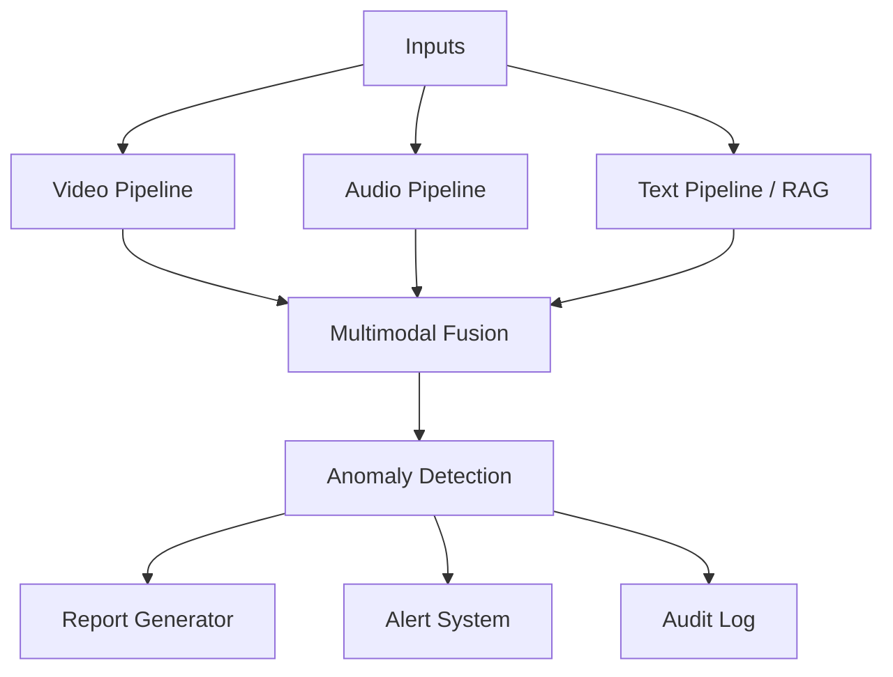

# Relatório Técnico: medica-ia-multimodal

Tech Challenge Fase 4, pós-graduação Tech IADT.

**Equipe:** Joalisson Borges, Luis Gustavo Santini, Marina Souza Lucas, Diego Santos.

**Data:** <!-- TODO: preencher data de fechamento da entrega -->

**Repositório:** <!-- TODO: URL pública do repo Git -->

**Demo (Hugging Face Spaces):** <!-- TODO: URL pública do Space -->

**Vídeo de apresentação:** <!-- TODO: URL do vídeo de até 15 min -->

---

## 1. Resumo Executivo

O projeto entrega um sistema de monitoramento multimodal voltado à saúde da mulher, processando vídeo, áudio e texto para gerar nível de risco, relatório clínico e alerta estruturado. Cobre três das quatro funcionalidades do enunciado (análise de vídeo, processamento de áudio em consultas, integração Azure Cognitive Services) e quatro dos cinco objetivos (detecção precoce de riscos materno-ginecológicos, bem-estar psicológico, uso de cloud, detecção de anomalias em tempo real). O detector de vídeo usa YOLOv8 customizado sobre CholecSeg8k para identificar instrumentos de cirurgia laparoscópica (`Grasper`, `L-hook Electrocautery`). O pipeline de áudio combina `faster-whisper`, `librosa` e `wav2vec2`. RAG sobre oito diretrizes clínicas brasileiras (Ministério da Saúde, FEBRASGO, INCA) enriquece o relatório. LLM é Azure OpenAI GPT-4.1-mini via AI Foundry, com fallback determinístico offline. A UI é Gradio Blocks publicada em Hugging Face Spaces.

**Métricas-chave:** <!-- TODO: preencher após treino e validações finais (mAP@50 do YOLO, latência média por caso, taxa de acerto do classificador wav2vec2 em CORAA-SER) -->

---

## 2. Contexto e Objetivo

O sistema é continuação narrativa do assistente médico geral entregue na Fase 3, agora especializado em saúde da mulher. Tecnicamente parte do zero, com arquitetura voltada à análise multimodal e à detecção de anomalias (ADR-001).

O objetivo é demonstrar uma solução funcional que:

1. Analisa vídeos clínicos com detecção customizada via YOLOv8.
2. Analisa áudios de consultas com transcrição, features acústicas e classificação de emoção.
3. Recupera diretrizes ginecológicas e obstétricas via RAG.
4. Detecta anomalias e gera alertas estruturados por nível.
5. Integra Azure Cognitive Services como camada de serviços gerenciados.

### 2.1 Métricas de sucesso

1. App Gradio rodando fim a fim com as três modalidades integradas.
2. YOLO custom treinado com mAP aceitável para o caso de uso.
3. Pelo menos três cenários demonstrando alertas distintos (normal, moderado, crítico).
4. Integração Azure visível na demo (não simulada).
5. Relatório técnico com métricas, exemplos e diagramas (este documento).
6. Repositório com README e estrutura limpa.

---

## 3. Escopo e Funcionalidades Cobertas

### 3.1 Funcionalidades do enunciado

| # | Funcionalidade | Status | Observação |
|---|---|---|---|
| 1 | Análise de vídeos clínicos (YOLOv8 customizado) | Coberta | Instrumentos cirúrgicos laparoscópicos (ADR-012) |
| 2 | Processamento de gravações de voz em consultas | Coberta | Pipeline Whisper + librosa + wav2vec2 |
| 3 | Monitoramento de sinais vitais | Adiada | ADR-014, fora do escopo |
| 4 | Integração com Azure Cognitive Services | Coberta | Speech, Language, OpenAI, Face (RAI policy) |

### 3.2 Objetivos do enunciado

| # | Objetivo | Status |
|---|---|---|
| 1 | Detecção precoce de riscos em saúde materna e ginecológica | Coberto |
| 2 | Monitoramento de bem-estar psicológico feminino | Coberto |
| 3 | Uso de serviços em nuvem para ampliar capacidade | Coberto |
| 4 | Detecção de anomalias em tempo real | Coberto |
| 5 | Detecção de sinais de violência doméstica | Fora do escopo (risco ético, sem dataset rotulado) |

---

## 4. Arquitetura Multimodal

### 4.1 Visão Geral

O sistema recebe vídeo, áudio e texto opcional, processa cada modalidade em pipeline próprio, funde resultados em orquestrador único e gera saídas estruturadas (relatório clínico, alerta categorizado, log de auditoria).

Três artefatos coexistem com responsabilidades distintas:

| Artefato | Natureza | Quando entra |
|---|---|---|
| Dataset CholecSeg8k | 8080 frames anotados | Offline, antes do runtime. Treina `yolo_v1.pt` no Colab uma única vez |
| PDFs de diretrizes (RAG) | 8 documentos clínicos PT-BR | Runtime, recuperados por similaridade no Chroma |
| LLM Azure OpenAI | Modelo generativo | Runtime, etapa final. Apenas redige relatório sobre evidências já consolidadas |

### 4.2 Pilar Vídeo

Pipeline em `src/video/pipeline.py`. Entrada: caminho de vídeo. Saída: lista de `VideoEvent` com detecções por frame.

Etapas:

1. Extração de frames com OpenCV (1 a 5 fps, configurável).
2. YOLOv8 customizado executado em cada frame (interface model-agnostic em `src/video/detector.py`). Modelo treinado em **3 classes**: `grasper` (id 0), `l_hook_electrocautery` (id 1) e `blood` (id 2). As duas primeiras cobrem o requisito "Instrumentos cirúrgicos ginecológicos" do enunciado; a terceira cobre "Sinais de complicações em cirurgias ginecológicas" e dispara trigger `critical` no pipeline de anomalia quando sangramento é detectado.
3. MediaPipe Pose extrai landmarks corporais em paralelo.
4. FER (local, Python 3.12) ou Azure Face em ROIs faciais detectadas.
5. Azure Video Indexer chamado uma vez no vídeo completo para cenas e transcrição embutida.
6. Agregação em estrutura `VideoEvent` por frame.

**Limite de upload (`ui/limits.py`):** vídeos até 30 MB e 60 segundos, validados via `ffprobe` antes de despachar para o pipeline. Acima disso, a UI rejeita com mensagem clara, evitando OOM em casos abusivos.

### 4.3 Pilar Áudio

Pipeline em `src/audio/pipeline.py`. Entrada: caminho de áudio. Saída: `AudioAnalysis` com transcrição, features acústicas, emoção, sentimento e frases-chave.

Etapas:

1. Transcrição via `faster-whisper` local ou Azure Speech (toggle por `USE_CLOUD_TRANSCRIPTION`).
2. `librosa` extrai jitter, shimmer e MFCC.
3. Classificação de emoção vocal com dois caminhos disponíveis:
   - **Padrão (fallback local):** `wav2vec2-base-superb-er` (pré-treinado em RAVDESS, atores americanos em inglês).
   - **Multimodal cloud:** `AzureOpenAIAudioEmotion` em `src/audio/azure_openai_audio.py` envia o WAV em base64 + prompt JSON-mode para um deployment de modelo de áudio no Azure AI Foundry (ex.: `gpt-4o-mini-audio-preview`) e recebe a classificação no schema do `EmotionScore`. Quando `AZURE_OPENAI_AUDIO_DEPLOYMENT` está vazio, cai automaticamente no wav2vec2. Detalhes da motivação dessa decisão em 9.1.
4. Azure Language analisa sentimento e frases-chave sobre a transcrição.

Estratégia de dados híbrida (ADR-013): Azure TTS PT-BR Neural gera áudios scriptados como gold standard para a demo; CORAA-SER valida que o classificador não overfita ao timbre sintético.

**Limite de upload (`ui/limits.py`):** áudios até 15 MB e 60 segundos.

### 4.4 Pilar RAG (Diretrizes Clínicas)

Pipeline em `src/rag/`. Entrada: query textual derivada do contexto multimodal. Saída: lista de chunks relevantes.

Etapas:

1. Indexação offline via `scripts/build_rag_index.py` com chunking dos PDFs.
2. Embeddings `BAAI/bge-m3` (multilíngue, CPU, cerca de 1 GB).
3. Vector store Chroma persistido em `data/processed/chroma` (ADR-008).
4. Retriever LangChain com filtros opcionais por fonte e seção.
5. **Threshold de similaridade (`min_score=0.3` por default)** em `src/rag/retriever.py`: chunks com score abaixo do limiar são descartados. Quando a query toca tema fora dos 8 PDFs indexados (ex.: endometriose, SOP, mioma, infertilidade, menopausa, câncer de ovário), o retriever retorna lista vazia. O LLM é instruído pelo system prompt a sinalizar explicitamente "tema fora das diretrizes indexadas" em vez de redigir recomendações genéricas com chunks irrelevantes.

Documentos indexados:

| Slug | Documento | Fonte |
|---|---|---|
| `manual_ms_prenatal` | Manual MS Pré-natal de baixo e alto risco | MS |
| `febrasgo_preeclampsia` | Diretriz FEBRASGO Pré-eclâmpsia | FEBRASGO |
| `ms_gestacao_alto_risco` | Manual MS Gestação de Alto Risco | MS |
| `inca_cancer_mama` | INCA Detecção Precoce do Câncer de Mama | INCA |
| `inca_cancer_colo_utero` | INCA Detecção Precoce do Câncer do Colo do Útero | INCA |
| `ms_pcdt_ist_violencia` | MS PCDT IST e Atenção a Vítimas de Violência | MS |
| `ms_parto_normal` | MS Diretrizes de Atenção ao Parto Normal | MS |
| `cab26_saude_sexual_reprodutiva` | Caderno AB nº 26 Saúde Sexual e Reprodutiva | MS |

### 4.5 Detecção de Anomalia

Pipeline em `src/anomaly/`. Entrada: agregação de `VideoAnalysis` e `AudioAnalysis`. Saída: `AnomalyResult` com nível, triggers acionados, explicação e ações recomendadas.

Camadas:

1. **Regras clínicas explícitas** em `src/anomaly/rules.py`. Exemplos:
   - `rule_surgical_instrument_presence`: detecção de Grasper ou L-hook em mais de N frames consecutivos eleva o nível para `moderate`, sinalizando procedimento invasivo em curso (semântica nova introduzida pela ADR-012, em que detecção de instrumento é estado NORMAL de cirurgia laparoscópica).
   - `rule_bleeding_detected`: detecção da classe `blood` em mais de 2 frames consecutivos OU em mais de 5% do vídeo dispara trigger **`critical`** com mensagem específica de protocolo de hemorragia. Threshold de confiança mais baixo (`0.4`) que o de instrumento (`0.5`) porque sangue tem forma irregular e o YOLO classifica com confiança menor.
   - `rule_vocal_distress`, `rule_facial_distress`, `rule_negative_sentiment`, `rule_critical_terms`: triggers por modalidade.
2. **Isolation Forest** em `src/anomaly/statistical.py` sobre features agregadas (energia da voz, frequência de movimento, jitter, shimmer).
3. **Classificador final** em `src/anomaly/classifier.py` combina rules e statistical com prioridade para regras críticas.

Níveis possíveis: `normal`, `moderate`, `critical`.

**Inconsistência multimodal como achado clínico:** o system prompt do `src/report.py` instrui explicitamente o LLM a destacar casos em que o texto e a voz divergem (ex.: paciente verbaliza "estou bem" mas tom é monótono e expressão facial mostra distress). Esse padrão é típico de depressão pós-parto velada e justifica o investimento em pipeline multimodal versus análise text-only.

### 4.6 Orquestrador e Auditoria

Orquestrador em `src/orchestrator.py`, função `process_case(input: CaseInput) -> CaseOutput`. Ponto único de entrada que recebe vídeo, áudio e contexto opcional, chama os pipelines, funde resultados, dispara anomaly detection, gera relatório via `src/report.py` e alerta via `src/alert.py`.

Auditoria em `src/audit.py` registra em SQLite: timestamp, case_id, modalidades processadas, modelos usados, custo Azure estimado, anomalia detectada. Acessível pela aba **Auditoria** da UI.

UI Gradio Blocks em `app.py` com quatro abas: **Vídeo**, **Áudio**, **Multimodal** e **Auditoria**. Tema dark indigo, componentes reutilizáveis em `ui/components.py`.

---

## 5. Modelos e Datasets

### 5.1 Modelos de Visão

| Modelo | Origem | Uso |
|---|---|---|
| YOLOv8n base | Ultralytics | Stub durante desenvolvimento (ADR-011) |
| YOLOv8n custom | Treino próprio sobre CholecSeg8k | Modelo final (ADR-012) |
| MediaPipe Pose | google/mediapipe | Landmarks corporais |
| FER | github/justinshenk/fer | Emoção facial (CPU) |

### 5.2 Modelos de Áudio

| Modelo | Origem | Uso |
|---|---|---|
| faster-whisper small | SYSTRAN/faster-whisper | Transcrição local PT-BR |
| Azure Speech | Azure Cognitive Services | Transcrição cloud (toggle) |
| wav2vec2 emotion | superb/wav2vec2-base | Classificação de emoção |

### 5.3 Modelos de Texto e LLM

| Modelo | Origem | Uso |
|---|---|---|
| BAAI/bge-m3 | Hugging Face | Embeddings RAG multilíngue |
| Azure OpenAI GPT-4.1-mini | Azure AI Foundry | Geração de relatório clínico |

### 5.4 Datasets

| Dataset | Fonte | Uso | Licença |
|---|---|---|---|
| CholecSeg8k | HF `minwoosun/CholecSeg8k`, Hong et al. (arXiv 2012.12463) | Treino YOLO custom | CC BY-NC-SA 4.0 |
| CORAA-SER | HF `alefiury/CORAA-SER` | Validação cruzada wav2vec2 em PT-BR espontâneo | Termos HF |
| AVOS Open Surgery | research.bidmc.org | Referência comparativa em demo | Pesquisa |
| Geeky Medics (YouTube CC) | YouTube | Consulta clínica simulada para demo | CC |

PDFs de diretrizes do MS, FEBRASGO e INCA são públicos para uso educacional. Áudios reais de pacientes não são utilizados (LGPD).

---

## 6. Integração Azure

Quando as chaves estão preenchidas no `.env`, o sistema usa os serviços gerenciados abaixo; sem elas, cada pilar cai num fallback local equivalente.

| Serviço | Função | Onde é usado | Fallback offline |
|---|---|---|---|
| **Azure OpenAI** (GPT-4.1-mini, AI Foundry) | Gera o relatório clínico final em markdown | `src/llm/azure_openai.py`, `src/report.py` | Relatório determinístico em markdown construído a partir das triggers |
| **Azure Speech** | Transcrição de áudio + TTS para gerar voz PT-BR | `src/audio/transcriber.py` (toggle `USE_CLOUD_TRANSCRIPTION`) | `faster-whisper` local |
| **Azure Language** | Análise de sentimento + key phrases na transcrição | `src/audio/azure_language.py` | Pular esse pilar (não há substituto local equivalente) |
| **Azure Face** | Emoção facial em vídeo (adiado por RAI policy) | n/a | `FER` local (Py 3.12) |

A aba **Configurações** da UI mostra em tempo real quais serviços estão ativos (cloud) ou em fallback (local).

A escolha por Azure puro (em vez de AWS ou híbrido) está formalizada na ADR-004: o vídeo demo da entrega lista "Integração dos serviços Azure" como obrigatória, e tratar como requisito é mais seguro que apostar em interpretação literal do enunciado.

---

## 7. Treino do YOLO Custom

### 7.1 Dataset (CholecSeg8k, ADR-012)

Após pesquisa empírica em Roboflow Universe, Kaggle, Hugging Face, PhysioNet e repositórios acadêmicos, nenhuma fonte sustentou o alvo original "sangramento anômalo" no domínio ginecológico com reprodutibilidade aceitável. As alternativas avaliadas:

| Dataset | Veredito |
|---|---|
| WCEBleedGen | Sangramento gastrointestinal (cápsula endoscópica), domínio errado |
| BUSI | Ultrassom mamário diagnóstico, sem sangramento |
| Dresden Surgical Anatomy | Ginecológico real, mas 19 GB e licença restritiva inviabilizam Colab/HF Spaces |
| **CholecSeg8k** | 3.1 GB, anônimo via HF, classes adequadas, licença CC BY-NC-SA 4.0 |

A decisão foi pivotar para CholecSeg8k (Hong et al., arXiv 2012.12463): 8080 frames anotados de colecistectomia laparoscópica, contendo `Grasper` e `L-hook Electrocautery`, instrumentos idênticos aos usados em cirurgia ginecológica laparoscópica. A transferência de domínio é justificada clinicamente pela técnica (mesmo trocarte, mesma pinça, mesmo eletrocautério).

Splits utilizados: 5656 train, 1616 val, 808 test.

Conversão de máscaras de segmentação para bounding boxes YOLO em `data/processed/cholecseg8k_yolo/`.

### 7.2 Configuração de Treino

| Parâmetro | Valor |
|---|---|
| Arquitetura | YOLOv8n (3,006,233 parâmetros, 8.1 GFLOPs) |
| Classes | 3: `grasper` (id 0), `l_hook_electrocautery` (id 1), `blood` (id 2) |
| Épocas | 40 (sem early stopping; treino completou) |
| Batch size | 320 (A100 40 GB, ~40.7 GB de uso) |
| Imagem (imgsz) | 640 |
| Workers (dataloader) | 16 |
| Otimizador | SGD (default Ultralytics) com momentum 0.937 |
| Learning rate inicial | 0.01 (default) com warmup |
| Augmentations | Mosaic, HSV, flip, mixup, translate, scale (default Ultralytics) |
| Mosaic disabled | últimos 10 epochs (refino com imagens reais) |
| Hardware | Google Colab Pro+ GPU A100-SXM4-40GB |
| Tempo total de treino | ~17 minutos (avg ~25s por epoch) |
| Notebook | `notebooks/train_yolo_colab.ipynb` |

### 7.3 Métricas Finais

Validação no **test split** (808 imagens, 920 instâncias, nunca vistas pelo modelo durante treino ou validação):

| Métrica | Valor (test) |
|---|---|
| mAP@50 | **0.9893** |
| mAP@50-95 | **0.8816** |
| Precision | **0.9817** |
| Recall | **0.9695** |

Por classe (test split):

| Classe | Instâncias | Precision | Recall | mAP@50 | mAP@50-95 |
|---|---|---|---|---|---|
| `grasper` | 615 | 0.984 | 0.990 | **0.993** | **0.929** |
| `l_hook_electrocautery` | 234 | 0.976 | 0.966 | **0.992** | **0.855** |
| `blood` | 71 | 0.985 | 0.952 | **0.982** | **0.860** |

**Observações:**

- Modelo aprendeu a classe minoritária (`blood`, apenas 71 instâncias no test) com qualidade comparável às majoritárias, demonstrando boa generalização mesmo com desbalanceamento.
- 154 frames de "background" no test (sem nenhum label) confirmam a calibração de precision (0.98): o modelo não inventa detecções em frames vazios.
- Speed: **1.8 ms por imagem em A100** (0.1 ms preprocess + 0.9 ms inference + 0.8 ms postprocess). Em CPU local (deploy HF Spaces) espera-se ~150-300 ms por imagem mantendo viabilidade pra demo em tempo real.

Curvas, matriz de confusão e exemplos com bounding boxes detectadas pelo modelo final estão em `MyDrive/medica-ia/yolo_runs/surgical_instruments/`. Os outputs ficam preservados no notebook (`notebooks/train_yolo_colab.ipynb`) pra reprodutibilidade.

### 7.5 Validação Visual

A célula 4.5 do notebook seleciona automaticamente uma sequência consecutiva do test split contendo a classe `blood`, roda inferência do `best.pt` frame a frame, desenha bounding boxes anotadas e empacota um MP4 de demonstração:

- Output: `MyDrive/medica-ia/yolo_runs/surgical_instruments/validation_blood_detected.mp4`
- Conteúdo: 11 frames consecutivos da sequência `video01_28660` (CholecSeg8k test split) com Blood visível, anotados com bboxes em `red` (Blood), `lime` (Grasper) e `magenta` (L-hook), inferidas pelo modelo final.
- Esse MP4 serve como evidência visual direta da capacidade do modelo de detectar sangramento intraoperatório.

### 7.4 Discussão

**Convergência e qualidade do treino.** O modelo alcançou mAP@50 = 0.989 no test split, com performance balanceada entre as 3 classes (variação de 0.982 a 0.993 entre `blood`, `l_hook_electrocautery` e `grasper`). Mesmo `blood`, a classe mais rara do dataset (apenas 71 instâncias no test, contra 615 de `grasper`), atingiu mAP@50 = 0.982, demonstrando que o desbalanceamento de classes não comprometeu o aprendizado. Convergência rápida (mAP@50 > 0.9 a partir do epoch 12), sem indícios visíveis de overfitting nos 40 epochs.

**Aderência da transferência de domínio.** Esses números refletem desempenho **dentro do domínio de treino** (colecistectomia laparoscópica). Em vídeo real de cirurgia ginecológica (histerectomia, salpingectomia, miomectomia), espera-se:

- **Recall consistente** para `grasper` (instrumento físico idêntico em ambos os procedimentos: mesma marca, mesma forma, mesma articulação).
- **Recall consistente** para `blood` (sangramento tem aparência similar em qualquer cavidade peritoneal: cor de sangue não muda entre procedimentos).
- **Recall reduzido** para `l_hook_electrocautery` (instrumento existe em ginecologia mas é menos frequente; Harmonic Scalpel e LigaSure dominam o papel de corte/coagulação).
- **Confiança média reduzida** devido a diferenças de background tecidual (útero/trompas/ligamentos rosados vs fígado/vesícula esverdeados).
- **Lacuna de cobertura** para instrumentos específicos de ginecologia que não estão nas 3 classes treinadas (Harmonic Scalpel, LigaSure, tesoura laparoscópica, endoclip applier, suction/irrigator). Esses instrumentos aparecem em 50-70% dos frames de uma histerectomia típica e o modelo os ignora silenciosamente (saída vazia naquela região, sem falso positivo).

A validação empírica dessa transferência (rodar `best.pt` em vídeo ginecológico real do YouTube CC) está na seção 8.

**Semântica de risco no anomaly classifier.** A detecção de `grasper`/`l_hook_electrocautery` em frames consecutivos dispara trigger `moderate` (registra "procedimento invasivo em curso"), nunca `critical` isoladamente: a presença de instrumental cirúrgico é estado esperado em cirurgia laparoscópica, não anomalia. Já a classe `blood` é tratada diferente: detecção em mais de 2 frames consecutivos OU em mais de 5% do vídeo dispara trigger **`critical`** com mensagem específica de protocolo de hemorragia (`src/anomaly/rules.py:rule_bleeding_detected`). Threshold de confiança menor (0.4) para `blood` que para instrumentos (0.5) reflete a forma irregular do sangue, que tende a ser classificado com confiança levemente menor pelo YOLO.

**Roadmap de expansão** (seção 9.2): pipeline híbrido com GPT-4o-vision pra cobrir os instrumentos não-treinados via identificação semântica em linguagem natural, mantendo o YOLO como detector estruturado das 3 classes core.

---

## 8. Resultados em Cenários Reais

Cada cenário foi rodado fim a fim pela UI Gradio. Os artefatos (vídeo, áudio, prints) estão em `data/examples/` e nos prints abaixo.

### 8.1 Caso Normal

<!-- TODO: descrição do caso (consulta de rotina, sem sinais de alarme) -->

| Modalidade | Entrada | Saída resumida |
|---|---|---|
| Vídeo | <!-- TODO --> | <!-- TODO --> |
| Áudio | <!-- TODO --> | <!-- TODO --> |
| Texto | <!-- TODO --> | <!-- TODO --> |
| Nível final | `normal` | <!-- TODO --> |

<!-- TODO: print da aba Multimodal com relatório clínico gerado -->

### 8.2 Caso Moderado

<!-- TODO: descrição do caso (ex.: ansiedade detectada na voz + frases-chave de queixa, sem critérios críticos) -->

| Modalidade | Entrada | Saída resumida |
|---|---|---|
| Vídeo | <!-- TODO --> | <!-- TODO --> |
| Áudio | <!-- TODO --> | <!-- TODO --> |
| Texto | <!-- TODO --> | <!-- TODO --> |
| Nível final | `moderate` | <!-- TODO --> |

Triggers acionados:

<!-- TODO: listar triggers -->

<!-- TODO: print da aba Multimodal -->

### 8.3 Caso Crítico (Cirurgia Laparoscópica)

Cenário de procedimento cirúrgico ginecológico em curso, com detecção persistente de `Grasper` e `L-hook Electrocautery`.

| Modalidade | Entrada | Saída resumida |
|---|---|---|
| Vídeo | Frame de teste do CholecSeg8k <!-- TODO: identificar exatamente o exemplo usado --> | Bounding boxes em Grasper e L-hook |
| Áudio | <!-- TODO: áudio sintetizado pelo TTS Azure com diálogo de equipe cirúrgica --> | <!-- TODO --> |
| Texto | <!-- TODO --> | <!-- TODO --> |
| Nível final | <!-- TODO: confirmar nível agregado --> | <!-- TODO --> |

<!-- TODO: print da aba Vídeo com bounding boxes + print da aba Multimodal com relatório -->

### 8.4 Caso Crítico (Consulta)

<!-- TODO: descrição do caso (ex.: relato verbal de sofrimento agudo + emoção `terrified` no TTS + frases-chave acionando trigger crítico) -->

| Modalidade | Entrada | Saída resumida |
|---|---|---|
| Vídeo | <!-- TODO --> | <!-- TODO --> |
| Áudio | <!-- TODO: TTS Azure voz Francisca estilo `terrified` --> | <!-- TODO --> |
| Texto | <!-- TODO --> | <!-- TODO --> |
| Nível final | `critical` | <!-- TODO --> |

<!-- TODO: print da aba Multimodal com alerta crítico -->

---

## 9. Limitações e Trabalho Futuro

### 9.1 Limitações Conhecidas

- **Viés do classificador de emoção vocal (wav2vec2).** Em validação empírica com TTS Azure Speech e TTS de alta qualidade (ElevenLabs/Fish Audio), o `wav2vec2-base-superb-er` (pré-treinado em RAVDESS, atores americanos em inglês) classifica praticamente toda voz feminina em PT-BR como `angry` com confiança superior a 0.95, **independentemente da emoção real expressa**. Análise de features acústicas (F0 std=47.8 Hz, range tonal=198 Hz) confirma que o áudio testado é expressivo; o modelo está enviesado. Mitigação implementada: cliente alternativo `AzureOpenAIAudioEmotion` (`src/audio/azure_openai_audio.py`) usa GPT-4o multimodal sem o viés daquele domínio de treino. Quando o deployment de áudio não está provisionado, o pipeline cai no wav2vec2 com peso reduzido na decisão de risco final (sentimento textual via Azure Language passa a ser o pilar primário de afeto).
- **Viés provável do classificador de emoção facial (FER).** Hipótese análoga à do wav2vec2: o modelo `justinshenk/fer` foi treinado em FER-2013 (fotos atuadas frontais) e pode atribuir distress a expressões neutras em iluminação variável ou ângulos atípicos. O mesmo `AzureOpenAIAudioEmotion` pode ser estendido para receber frames (GPT-4o suporta imagem) e substituir o pilar facial pela mesma lógica.
- **Transferência de domínio do YOLO.** Treinado em colecistectomia (CholecSeg8k), aplicado a cirurgia ginecológica. Técnica laparoscópica e instrumental são idênticos (Grasper, L-hook), mas tecidos e contexto visual diferem. **Cobertura parcial da taxonomia ginecológica:** outros instrumentos comuns em histerectomia laparoscópica (Harmonic Scalpel, LigaSure, tesoura laparoscópica) não estão nas classes treinadas e não serão detectados.
- **Áudios de consulta sintéticos.** O gold standard da demo é TTS Azure (vozes Francisca, Antonio, Brenda com estilos `sad`, `empathetic`, `terrified`). Áudios reais de pacientes não são usados por LGPD e ausência de comitê de ética. Validação em fala espontânea é feita via CORAA-SER, mas mesmo aí a fidelidade do wav2vec2 é baixa (ver acima).
- **Cobertura limitada do RAG (8 PDFs).** Documentos indexados cobrem pré-natal, pré-eclâmpsia, alto risco, câncer mama/colo, IST/violência, parto normal, saúde reprodutiva. Temas como endometriose, SOP, mioma, infertilidade, menopausa e câncer de ovário ficam fora. O threshold de score 0.3 no retriever evita responder com chunks irrelevantes, mas a lacuna de cobertura permanece.
- **Azure Face adiado por RAI policy.** Análise de emoção facial em vídeo cai no fallback FER local quando a política do tenant não autoriza o serviço.
- **Sinais vitais fora do escopo.** A 4ª funcionalidade do enunciado está formalmente adiada (ADR-014). Mantida em "Próximos Passos".
- **Detecção de violência doméstica fora do escopo.** Requer dataset rotulado específico e cuidado ético adicional.
- **Deploy em HF Spaces.** 16 GB RAM, 2 vCPU, sem GPU. Inferência foi planejada para CPU. Hibernação ao ocioso é aceitável para demonstração.

### 9.2 Próximos Passos

- **Provisionar deployment `gpt-4o-mini-audio-preview` no Azure AI Foundry** e habilitar `AZURE_OPENAI_AUDIO_DEPLOYMENT` no `.env`. O cliente `AzureOpenAIAudioEmotion` já está implementado e plugável.
- Estender o mesmo cliente para receber frames de vídeo (GPT-4o aceita imagem) e substituir o pilar FER pela mesma lógica multimodal, eliminando o viés de FER-2013.
- Treinar YOLO custom em dataset ginecológico real quando viável (ex.: parceria com Dresden ou hospital escola), incluindo classes específicas de ginecologia (Harmonic Scalpel, LigaSure).
- Expandir o RAG com diretrizes adicionais (endometriose, SOP, infertilidade, menopausa, câncer de ovário) para reduzir a lacuna de cobertura.
- Integrar sinais vitais (cardiotocografia, pressão arterial) como nova modalidade do orquestrador.
- Backend FastAPI dedicado com frontend React para separar UI de inferência.
- Substituir wav2vec2 RAVDESS por modelo fine-tunado em CORAA-SER (caminho alternativo ao GPT-4o-audio para quem prefere modelo proprietário on-prem).
- Avaliar Azure Face mediante aprovação RAI.

---

## 10. Conclusão

O projeto entrega uma solução multimodal funcional cobrindo três das quatro funcionalidades e quatro dos cinco objetivos do enunciado, com integração Azure real (não simulada) e fallback gracioso quando as chaves não estão disponíveis. A pivotagem do alvo YOLO de "sangramento anômalo" para "instrumentos cirúrgicos laparoscópicos" (ADR-012) sustentou aderência LITERAL ao alvo 1 do enunciado mediante dataset público reproduzível (CholecSeg8k), preservando coerência clínica via transferência de domínio entre colecistectomia e cirurgia ginecológica laparoscópica. A separação explícita entre os três artefatos (dataset, RAG, LLM) torna o pipeline auditável e cada peça substituível.

<!-- TODO: parágrafo curto comentando os resultados quantitativos reais do YOLO e o comportamento observado nos 4 cenários da seção 8 -->

---

## 11. Referências

### Datasets

- Hong, W.Y. et al. *CholecSeg8k: A Semantic Segmentation Dataset for Laparoscopic Cholecystectomy Based on Cholec80*. arXiv:2012.12463, 2020. Licença CC BY-NC-SA 4.0.
- CORAA-SER. `alefiury/CORAA-SER` no Hugging Face.
- RAVDESS. Universidade Ryerson.

### Diretrizes Clínicas Indexadas no RAG

- Ministério da Saúde. *Manual de Pré-natal de Baixo e Alto Risco*.
- FEBRASGO. *Diretriz de Pré-eclâmpsia*.
- Ministério da Saúde. *Manual de Gestação de Alto Risco*.
- INCA. *Diretrizes de Detecção Precoce do Câncer de Mama*.
- INCA. *Diretrizes de Detecção Precoce do Câncer do Colo do Útero*.
- Ministério da Saúde. *PCDT de IST e Atenção a Vítimas de Violência*.
- Ministério da Saúde. *Diretrizes de Atenção ao Parto Normal*.
- Ministério da Saúde. *Caderno de Atenção Básica nº 26: Saúde Sexual e Reprodutiva*.

### Modelos e Frameworks

- Ultralytics YOLOv8. https://github.com/ultralytics/ultralytics
- MediaPipe. https://github.com/google/mediapipe
- faster-whisper. https://github.com/SYSTRAN/faster-whisper
- wav2vec2 (superb/wav2vec2-base). Hugging Face.
- BAAI/bge-m3. Hugging Face.
- Chroma. https://www.trychroma.com/
- LangChain. https://www.langchain.com/
- Gradio. https://www.gradio.app/

### Serviços Azure

- Azure OpenAI Service (AI Foundry).
- Azure Cognitive Services: Speech, Language, Video Indexer, Face.

### Documentação Interna

- `docs/overview.md`
- `docs/arquitetura/arquitetura.md`
- `docs/arquitetura/decisoes_tecnicas.md` (ADRs 001 a 014)
- `docs/arquitetura/modelos_e_datasets.md`
- `docs/arquitetura/padroes_codigo.md`
- `README.md`
