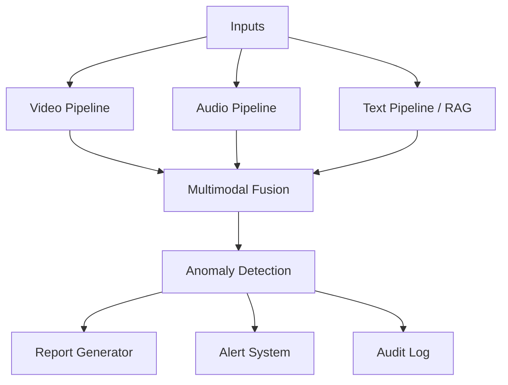

# Relatório Técnico: medica-ia-multimodal

Tech Challenge Fase 4, pós-graduação Tech IADT.

**Equipe:** Joalisson Borges, Luis Gustavo Santini, Marina Souza Lucas, Diego Santos.

**Data:** <!-- TODO: preencher data de fechamento da entrega -->

**Repositório:** <!-- TODO: URL pública do repo Git -->

**Demo (Hugging Face Spaces):** <!-- TODO: URL pública do Space -->

**Vídeo de apresentação:** <!-- TODO: URL do vídeo de até 15 min -->

---

## 1. Resumo Executivo

O projeto entrega um sistema de monitoramento multimodal voltado à saúde da mulher, processando vídeo, áudio e texto para gerar nível de risco, relatório clínico e alerta estruturado. Cobre três das quatro funcionalidades do enunciado (análise de vídeo, processamento de áudio em consultas, integração Azure Cognitive Services) e quatro dos cinco objetivos (detecção precoce de riscos materno-ginecológicos, bem-estar psicológico, uso de cloud, detecção de anomalias em tempo real). O detector de vídeo usa YOLOv8 customizado sobre CholecSeg8k para identificar instrumentos de cirurgia laparoscópica (`Grasper`, `L-hook Electrocautery`). O pipeline de áudio combina `faster-whisper`, `librosa` e `wav2vec2`. RAG sobre oito diretrizes clínicas brasileiras (Ministério da Saúde, FEBRASGO, INCA) enriquece o relatório. LLM é Azure OpenAI GPT-4.1-mini via AI Foundry, com fallback determinístico offline. A UI é Gradio Blocks publicada em Hugging Face Spaces.

**Métricas-chave:** <!-- TODO: preencher após treino e validações finais (mAP@50 do YOLO, latência média por caso, taxa de acerto do classificador wav2vec2 em CORAA-SER) -->

---

## 2. Contexto e Objetivo

O sistema é continuação narrativa do assistente médico geral entregue na Fase 3, agora especializado em saúde da mulher. Tecnicamente parte do zero, com arquitetura voltada à análise multimodal e à detecção de anomalias (ADR-001).

O objetivo é demonstrar uma solução funcional que:

1. Analisa vídeos clínicos com detecção customizada via YOLOv8.
2. Analisa áudios de consultas com transcrição, features acústicas e classificação de emoção.
3. Recupera diretrizes ginecológicas e obstétricas via RAG.
4. Detecta anomalias e gera alertas estruturados por nível.
5. Integra Azure Cognitive Services como camada de serviços gerenciados.

### 2.1 Métricas de sucesso

1. App Gradio rodando fim a fim com as três modalidades integradas.
2. YOLO custom treinado com mAP aceitável para o caso de uso.
3. Pelo menos três cenários demonstrando alertas distintos (normal, moderado, crítico).
4. Integração Azure visível na demo (não simulada).
5. Relatório técnico com métricas, exemplos e diagramas (este documento).
6. Repositório com README e estrutura limpa.

---

## 3. Escopo e Funcionalidades Cobertas

### 3.1 Funcionalidades do enunciado

| # | Funcionalidade | Status | Observação |
|---|---|---|---|
| 1 | Análise de vídeos clínicos (YOLOv8 customizado) | Coberta | Instrumentos cirúrgicos laparoscópicos (ADR-012) |
| 2 | Processamento de gravações de voz em consultas | Coberta | Pipeline Whisper + librosa + wav2vec2 |
| 3 | Monitoramento de sinais vitais | Adiada | ADR-014, fora do escopo |
| 4 | Integração com Azure Cognitive Services | Coberta | Speech, Language, OpenAI, Face (RAI policy) |

### 3.2 Objetivos do enunciado

| # | Objetivo | Status |
|---|---|---|
| 1 | Detecção precoce de riscos em saúde materna e ginecológica | Coberto |
| 2 | Monitoramento de bem-estar psicológico feminino | Coberto |
| 3 | Uso de serviços em nuvem para ampliar capacidade | Coberto |
| 4 | Detecção de anomalias em tempo real | Coberto |
| 5 | Detecção de sinais de violência doméstica | Fora do escopo (risco ético, sem dataset rotulado) |

---

## 4. Arquitetura Multimodal

### 4.1 Visão Geral

O sistema recebe vídeo, áudio e texto opcional, processa cada modalidade em pipeline próprio, funde resultados em orquestrador único e gera saídas estruturadas (relatório clínico, alerta categorizado, log de auditoria).

Três artefatos coexistem com responsabilidades distintas:

| Artefato | Natureza | Quando entra |
|---|---|---|
| Dataset CholecSeg8k | 8080 frames anotados | Offline, antes do runtime. Treina `yolo_v1.pt` no Colab uma única vez |
| PDFs de diretrizes (RAG) | 8 documentos clínicos PT-BR | Runtime, recuperados por similaridade no Chroma |
| LLM Azure OpenAI | Modelo generativo | Runtime, etapa final. Apenas redige relatório sobre evidências já consolidadas |

### 4.2 Pilar Vídeo

Pipeline em `src/video/pipeline.py`. Entrada: caminho de vídeo. Saída: lista de `VideoEvent` com detecções por frame.

Etapas:

1. Extração de frames com OpenCV (1 a 5 fps, configurável).
2. YOLOv8 customizado executado em cada frame (interface model-agnostic em `src/video/detector.py`).
3. MediaPipe Pose extrai landmarks corporais em paralelo.
4. FER (local, Python 3.12) ou Azure Face em ROIs faciais detectadas.
5. Azure Video Indexer chamado uma vez no vídeo completo para cenas e transcrição embutida.
6. Agregação em estrutura `VideoEvent` por frame.

### 4.3 Pilar Áudio

Pipeline em `src/audio/pipeline.py`. Entrada: caminho de áudio. Saída: `AudioAnalysis` com transcrição, features acústicas, emoção, sentimento e frases-chave.

Etapas:

1. Transcrição via `faster-whisper` local ou Azure Speech (toggle por `USE_CLOUD_TRANSCRIPTION`).
2. `librosa` extrai jitter, shimmer e MFCC.
3. `wav2vec2` (pré-treinado em RAVDESS) classifica emoção predominante.
4. Azure Language analisa sentimento e frases-chave sobre a transcrição.

Estratégia de dados híbrida (ADR-013): Azure TTS PT-BR Neural gera áudios scriptados como gold standard para a demo; CORAA-SER valida que o classificador não overfita ao timbre sintético.

### 4.4 Pilar RAG (Diretrizes Clínicas)

Pipeline em `src/rag/`. Entrada: query textual derivada do contexto multimodal. Saída: lista de chunks relevantes.

Etapas:

1. Indexação offline via `scripts/build_rag_index.py` com chunking dos PDFs.
2. Embeddings `BAAI/bge-m3` (multilíngue, CPU, cerca de 1 GB).
3. Vector store Chroma persistido em `data/processed/chroma` (ADR-008).
4. Retriever LangChain com filtros opcionais por fonte e seção.

Documentos indexados:

| Slug | Documento | Fonte |
|---|---|---|
| `manual_ms_prenatal` | Manual MS Pré-natal de baixo e alto risco | MS |
| `febrasgo_preeclampsia` | Diretriz FEBRASGO Pré-eclâmpsia | FEBRASGO |
| `ms_gestacao_alto_risco` | Manual MS Gestação de Alto Risco | MS |
| `inca_cancer_mama` | INCA Detecção Precoce do Câncer de Mama | INCA |
| `inca_cancer_colo_utero` | INCA Detecção Precoce do Câncer do Colo do Útero | INCA |
| `ms_pcdt_ist_violencia` | MS PCDT IST e Atenção a Vítimas de Violência | MS |
| `ms_parto_normal` | MS Diretrizes de Atenção ao Parto Normal | MS |
| `cab26_saude_sexual_reprodutiva` | Caderno AB nº 26 Saúde Sexual e Reprodutiva | MS |

### 4.5 Detecção de Anomalia

Pipeline em `src/anomaly/`. Entrada: agregação de `VideoAnalysis` e `AudioAnalysis`. Saída: `AnomalyResult` com nível, triggers acionados, explicação e ações recomendadas.

Camadas:

1. **Regras clínicas explícitas** em `src/anomaly/rules.py`. Exemplo: detecção de instrumental cirúrgico em mais de N frames consecutivos eleva o nível para `moderate`, sinalizando procedimento invasivo em curso (semântica nova introduzida pela ADR-012, em que detecção de instrumento é estado NORMAL de cirurgia laparoscópica).
2. **Isolation Forest** em `src/anomaly/statistical.py` sobre features agregadas (energia da voz, frequência de movimento, jitter, shimmer).
3. **Classificador final** em `src/anomaly/classifier.py` combina rules e statistical com prioridade para regras críticas.

Níveis possíveis: `normal`, `moderate`, `critical`.

### 4.6 Orquestrador e Auditoria

Orquestrador em `src/orchestrator.py`, função `process_case(input: CaseInput) -> CaseOutput`. Ponto único de entrada que recebe vídeo, áudio e contexto opcional, chama os pipelines, funde resultados, dispara anomaly detection, gera relatório via `src/report.py` e alerta via `src/alert.py`.

Auditoria em `src/audit.py` registra em SQLite: timestamp, case_id, modalidades processadas, modelos usados, custo Azure estimado, anomalia detectada. Acessível pela aba **Auditoria** da UI.

UI Gradio Blocks em `app.py` com quatro abas: **Vídeo**, **Áudio**, **Multimodal** e **Auditoria**. Tema dark indigo, componentes reutilizáveis em `ui/components.py`.

---

## 5. Modelos e Datasets

### 5.1 Modelos de Visão

| Modelo | Origem | Uso |
|---|---|---|
| YOLOv8n base | Ultralytics | Stub durante desenvolvimento (ADR-011) |
| YOLOv8n custom | Treino próprio sobre CholecSeg8k | Modelo final (ADR-012) |
| MediaPipe Pose | google/mediapipe | Landmarks corporais |
| FER | github/justinshenk/fer | Emoção facial (CPU) |

### 5.2 Modelos de Áudio

| Modelo | Origem | Uso |
|---|---|---|
| faster-whisper small | SYSTRAN/faster-whisper | Transcrição local PT-BR |
| Azure Speech | Azure Cognitive Services | Transcrição cloud (toggle) |
| wav2vec2 emotion | superb/wav2vec2-base | Classificação de emoção |

### 5.3 Modelos de Texto e LLM

| Modelo | Origem | Uso |
|---|---|---|
| BAAI/bge-m3 | Hugging Face | Embeddings RAG multilíngue |
| Azure OpenAI GPT-4.1-mini | Azure AI Foundry | Geração de relatório clínico |

### 5.4 Datasets

| Dataset | Fonte | Uso | Licença |
|---|---|---|---|
| CholecSeg8k | HF `minwoosun/CholecSeg8k`, Hong et al. (arXiv 2012.12463) | Treino YOLO custom | CC BY-NC-SA 4.0 |
| CORAA-SER | HF `alefiury/CORAA-SER` | Validação cruzada wav2vec2 em PT-BR espontâneo | Termos HF |
| AVOS Open Surgery | research.bidmc.org | Referência comparativa em demo | Pesquisa |
| Geeky Medics (YouTube CC) | YouTube | Consulta clínica simulada para demo | CC |

PDFs de diretrizes do MS, FEBRASGO e INCA são públicos para uso educacional. Áudios reais de pacientes não são utilizados (LGPD).

---

## 6. Integração Azure

Quando as chaves estão preenchidas no `.env`, o sistema usa os serviços gerenciados abaixo; sem elas, cada pilar cai num fallback local equivalente.

| Serviço | Função | Onde é usado | Fallback offline |
|---|---|---|---|
| **Azure OpenAI** (GPT-4.1-mini, AI Foundry) | Gera o relatório clínico final em markdown | `src/llm/azure_openai.py`, `src/report.py` | Relatório determinístico em markdown construído a partir das triggers |
| **Azure Speech** | Transcrição de áudio + TTS para gerar voz PT-BR | `src/audio/transcriber.py` (toggle `USE_CLOUD_TRANSCRIPTION`) | `faster-whisper` local |
| **Azure Language** | Análise de sentimento + key phrases na transcrição | `src/audio/azure_language.py` | Pular esse pilar (não há substituto local equivalente) |
| **Azure Face** | Emoção facial em vídeo (adiado por RAI policy) | n/a | `FER` local (Py 3.12) |

A aba **Configurações** da UI mostra em tempo real quais serviços estão ativos (cloud) ou em fallback (local).

A escolha por Azure puro (em vez de AWS ou híbrido) está formalizada na ADR-004: o vídeo demo da entrega lista "Integração dos serviços Azure" como obrigatória, e tratar como requisito é mais seguro que apostar em interpretação literal do enunciado.

---

## 7. Treino do YOLO Custom

### 7.1 Dataset (CholecSeg8k, ADR-012)

Após pesquisa empírica em Roboflow Universe, Kaggle, Hugging Face, PhysioNet e repositórios acadêmicos, nenhuma fonte sustentou o alvo original "sangramento anômalo" no domínio ginecológico com reprodutibilidade aceitável. As alternativas avaliadas:

| Dataset | Veredito |
|---|---|
| WCEBleedGen | Sangramento gastrointestinal (cápsula endoscópica), domínio errado |
| BUSI | Ultrassom mamário diagnóstico, sem sangramento |
| Dresden Surgical Anatomy | Ginecológico real, mas 19 GB e licença restritiva inviabilizam Colab/HF Spaces |
| **CholecSeg8k** | 3.1 GB, anônimo via HF, classes adequadas, licença CC BY-NC-SA 4.0 |

A decisão foi pivotar para CholecSeg8k (Hong et al., arXiv 2012.12463): 8080 frames anotados de colecistectomia laparoscópica, contendo `Grasper` e `L-hook Electrocautery`, instrumentos idênticos aos usados em cirurgia ginecológica laparoscópica. A transferência de domínio é justificada clinicamente pela técnica (mesmo trocarte, mesma pinça, mesmo eletrocautério).

Splits utilizados: 5656 train, 1616 val, 808 test.

Conversão de máscaras de segmentação para bounding boxes YOLO em `data/processed/cholecseg8k_yolo/`.

### 7.2 Configuração de Treino

| Parâmetro | Valor |
|---|---|
| Arquitetura | YOLOv8n |
| Épocas | <!-- TODO: preencher após treino --> |
| Batch size | <!-- TODO --> |
| Imagem (imgsz) | <!-- TODO --> |
| Otimizador | <!-- TODO --> |
| Learning rate inicial | <!-- TODO --> |
| Augmentations | <!-- TODO: listar (mosaic, flip, hsv, etc.) --> |
| Hardware | Google Colab GPU T4 |
| Tempo total de treino | <!-- TODO --> |
| Notebook | `notebooks/train_yolo_colab.ipynb` |

### 7.3 Métricas Finais

<!-- TODO: preencher após treino terminar -->

| Métrica | Valor (val) | Valor (test) |
|---|---|---|
| mAP@50 | <!-- TODO --> | <!-- TODO --> |
| mAP@50-95 | <!-- TODO --> | <!-- TODO --> |
| Precision | <!-- TODO --> | <!-- TODO --> |
| Recall | <!-- TODO --> | <!-- TODO --> |

Por classe:

| Classe | mAP@50 | Precision | Recall |
|---|---|---|---|
| Grasper | <!-- TODO --> | <!-- TODO --> | <!-- TODO --> |
| L-hook Electrocautery | <!-- TODO --> | <!-- TODO --> | <!-- TODO --> |

Curvas e matriz de confusão:

<!-- TODO: inserir prints de results.png, confusion_matrix.png, PR_curve.png gerados pelo Ultralytics -->

### 7.4 Discussão

<!-- TODO: discussão de transferência de domínio: colecistectomia (treino) vs cirurgia ginecológica laparoscópica (aplicação). Comentar limitações, falsos positivos observados em frames de demo, e como o nível `moderate` é acionado apenas quando o instrumento aparece em N frames consecutivos -->

Pontos a discutir manualmente após o treino:

- Aderência da transferência de domínio (técnica laparoscópica é a mesma; cenário visual difere quanto a tecidos pélvicos vs hepatobiliares).
- Comportamento do detector em frames de demo do split de test.
- Decisão semântica de a detecção de instrumento elevar para `moderate` apenas (nunca `critical` isoladamente).

---

## 8. Resultados em Cenários Reais

Cada cenário foi rodado fim a fim pela UI Gradio. Os artefatos (vídeo, áudio, prints) estão em `data/examples/` e nos prints abaixo.

### 8.1 Caso Normal

<!-- TODO: descrição do caso (consulta de rotina, sem sinais de alarme) -->

| Modalidade | Entrada | Saída resumida |
|---|---|---|
| Vídeo | <!-- TODO --> | <!-- TODO --> |
| Áudio | <!-- TODO --> | <!-- TODO --> |
| Texto | <!-- TODO --> | <!-- TODO --> |
| Nível final | `normal` | <!-- TODO --> |

<!-- TODO: print da aba Multimodal com relatório clínico gerado -->

### 8.2 Caso Moderado

<!-- TODO: descrição do caso (ex.: ansiedade detectada na voz + frases-chave de queixa, sem critérios críticos) -->

| Modalidade | Entrada | Saída resumida |
|---|---|---|
| Vídeo | <!-- TODO --> | <!-- TODO --> |
| Áudio | <!-- TODO --> | <!-- TODO --> |
| Texto | <!-- TODO --> | <!-- TODO --> |
| Nível final | `moderate` | <!-- TODO --> |

Triggers acionados:

<!-- TODO: listar triggers -->

<!-- TODO: print da aba Multimodal -->

### 8.3 Caso Crítico (Cirurgia Laparoscópica)

Cenário de procedimento cirúrgico ginecológico em curso, com detecção persistente de `Grasper` e `L-hook Electrocautery`.

| Modalidade | Entrada | Saída resumida |
|---|---|---|
| Vídeo | Frame de teste do CholecSeg8k <!-- TODO: identificar exatamente o exemplo usado --> | Bounding boxes em Grasper e L-hook |
| Áudio | <!-- TODO: áudio sintetizado pelo TTS Azure com diálogo de equipe cirúrgica --> | <!-- TODO --> |
| Texto | <!-- TODO --> | <!-- TODO --> |
| Nível final | <!-- TODO: confirmar nível agregado --> | <!-- TODO --> |

<!-- TODO: print da aba Vídeo com bounding boxes + print da aba Multimodal com relatório -->

### 8.4 Caso Crítico (Consulta)

<!-- TODO: descrição do caso (ex.: relato verbal de sofrimento agudo + emoção `terrified` no TTS + frases-chave acionando trigger crítico) -->

| Modalidade | Entrada | Saída resumida |
|---|---|---|
| Vídeo | <!-- TODO --> | <!-- TODO --> |
| Áudio | <!-- TODO: TTS Azure voz Francisca estilo `terrified` --> | <!-- TODO --> |
| Texto | <!-- TODO --> | <!-- TODO --> |
| Nível final | `critical` | <!-- TODO --> |

<!-- TODO: print da aba Multimodal com alerta crítico -->

---

## 9. Limitações e Trabalho Futuro

### 9.1 Limitações Conhecidas

- **Transferência de domínio do YOLO.** Treinado em colecistectomia, aplicado a cirurgia ginecológica. A técnica laparoscópica é equivalente, mas tecidos e contexto visual diferem. Avaliação visual em vídeos ginecológicos públicos é qualitativa, não há benchmark com ground truth no domínio alvo.
- **Áudios de consulta sintéticos.** O gold standard da demo é TTS Azure (vozes Francisca, Antonio, Brenda com estilos `sad`, `empathetic`, `terrified`). Áudios reais de pacientes não são usados por LGPD e ausência de comitê de ética. Validação em fala espontânea é feita via CORAA-SER, mas o classificador wav2vec2 ainda parte de RAVDESS (inglês atuado).
- **Azure Face adiado por RAI policy.** A análise de emoção facial em vídeo cai no fallback FER local quando a política do tenant não autoriza o serviço.
- **Sinais vitais fora do escopo.** A 4ª funcionalidade do enunciado está formalmente adiada (ADR-014). Mantida em "Próximos Passos".
- **Detecção de violência doméstica fora do escopo.** Requer dataset rotulado específico e cuidado ético adicional.
- **Deploy em HF Spaces.** 16 GB RAM, 2 vCPU, sem GPU. Inferência foi planejada para CPU. Hibernação ao ocioso é aceitável para demonstração.

### 9.2 Próximos Passos

- Integrar sinais vitais (cardiotocografia, pressão arterial) como nova modalidade do orquestrador.
- Treinar YOLO em dataset ginecológico real quando viável (ex.: parceria com Dresden ou hospital escola).
- Backend FastAPI dedicado com frontend React para separar UI de inferência.
- Substituir wav2vec2 RAVDESS por modelo fine-tunado em CORAA-SER para reduzir gap PT-BR.
- Avaliar Azure Face mediante aprovação RAI.

---

## 10. Conclusão

O projeto entrega uma solução multimodal funcional cobrindo três das quatro funcionalidades e quatro dos cinco objetivos do enunciado, com integração Azure real (não simulada) e fallback gracioso quando as chaves não estão disponíveis. A pivotagem do alvo YOLO de "sangramento anômalo" para "instrumentos cirúrgicos laparoscópicos" (ADR-012) sustentou aderência LITERAL ao alvo 1 do enunciado mediante dataset público reproduzível (CholecSeg8k), preservando coerência clínica via transferência de domínio entre colecistectomia e cirurgia ginecológica laparoscópica. A separação explícita entre os três artefatos (dataset, RAG, LLM) torna o pipeline auditável e cada peça substituível.

<!-- TODO: parágrafo curto comentando os resultados quantitativos reais do YOLO e o comportamento observado nos 4 cenários da seção 8 -->

---

## 11. Referências

### Datasets

- Hong, W.Y. et al. *CholecSeg8k: A Semantic Segmentation Dataset for Laparoscopic Cholecystectomy Based on Cholec80*. arXiv:2012.12463, 2020. Licença CC BY-NC-SA 4.0.
- CORAA-SER. `alefiury/CORAA-SER` no Hugging Face.
- RAVDESS. Universidade Ryerson.

### Diretrizes Clínicas Indexadas no RAG

- Ministério da Saúde. *Manual de Pré-natal de Baixo e Alto Risco*.
- FEBRASGO. *Diretriz de Pré-eclâmpsia*.
- Ministério da Saúde. *Manual de Gestação de Alto Risco*.
- INCA. *Diretrizes de Detecção Precoce do Câncer de Mama*.
- INCA. *Diretrizes de Detecção Precoce do Câncer do Colo do Útero*.
- Ministério da Saúde. *PCDT de IST e Atenção a Vítimas de Violência*.
- Ministério da Saúde. *Diretrizes de Atenção ao Parto Normal*.
- Ministério da Saúde. *Caderno de Atenção Básica nº 26: Saúde Sexual e Reprodutiva*.

### Modelos e Frameworks

- Ultralytics YOLOv8. https://github.com/ultralytics/ultralytics
- MediaPipe. https://github.com/google/mediapipe
- faster-whisper. https://github.com/SYSTRAN/faster-whisper
- wav2vec2 (superb/wav2vec2-base). Hugging Face.
- BAAI/bge-m3. Hugging Face.
- Chroma. https://www.trychroma.com/
- LangChain. https://www.langchain.com/
- Gradio. https://www.gradio.app/

### Serviços Azure

- Azure OpenAI Service (AI Foundry).
- Azure Cognitive Services: Speech, Language, Video Indexer, Face.

### Documentação Interna

- `docs/overview.md`
- `docs/arquitetura/arquitetura.md`
- `docs/arquitetura/decisoes_tecnicas.md` (ADRs 001 a 014)
- `docs/arquitetura/modelos_e_datasets.md`
- `docs/arquitetura/padroes_codigo.md`
- `README.md`
